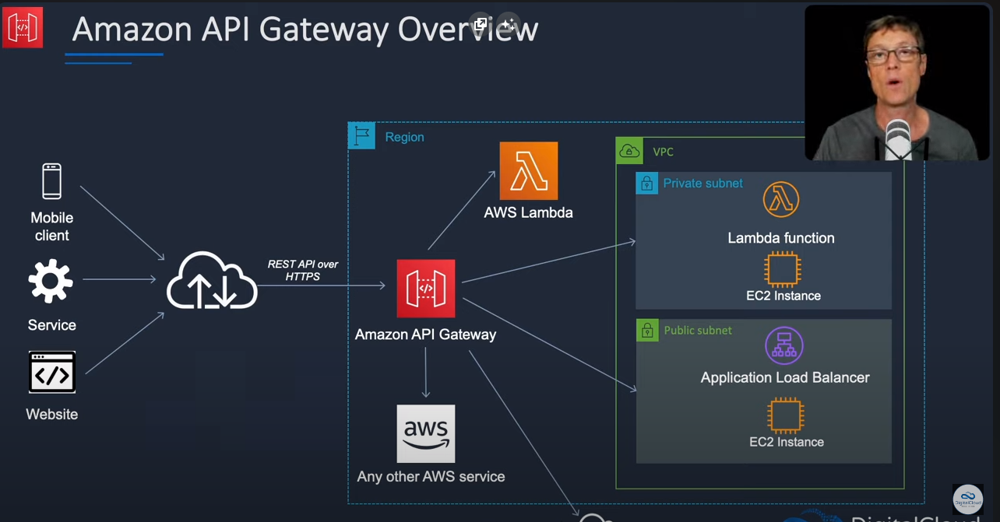
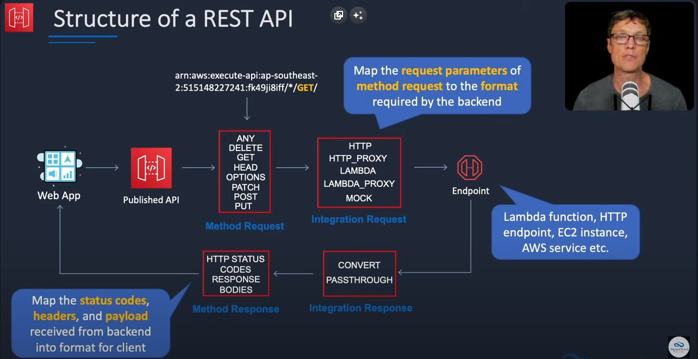

# Api Gateway

Application programming interfaces.

Un dispositivo necesita acceso a alguna lógica de negocio, o algún servicio corriendo en AWS. Podemos hacerlo conectando con la apiGateway, ya que esta se conectará con algún servicio backend que hayamos creado.

Permite formatear la informaicón en la request, importar templates como Swagger etc.



- Reduce la latencia de las requests alrededor del mundo y por region.
- Expone las REST API de forma segura hacia otros servicios dentro de la VPC o por conexión directa.



# Conexión con Lambda

Un ejemplo típico pero muy util es crear un servicio REST que invoque una función lambda

1. Creamos nuestra función lambda con un nombre y un runtime (python obviamente 😉)
2. Vamos a apiGateway y seleccionamos alguna de las opciones que soporte funciones lambda, HTTP API funcionará para este ejemplo (es la recomendada)
3. Seleccionamos en Integraciones nuestra función lambda, ponemos un nombre y click en siguiente
4. definimos las rutas que va a tener nuestra API, con su respectivo verbo y ruta.
5. siguiente siguiente crear

En este momento ya podremos utilizar la función lambda desde nuestro cliente http favorito. 

Utilizaremos este código para identificar el tipo de petición y realizar una acción específica.

```python
import json
import boto3
from boto3.dynamodb.conditions import Key, Attr
import uuid


def lambda_handler(event, context):
    dynamodb = boto3.resource('dynamodb')
    table = dynamodb.Table('likes_counter')

    if event["requestContext"]["http"]["method"] == "POST":
        item = json.loads(event["body"])
        id = str(uuid.uuid5(uuid.NAMESPACE_DNS, f'{item["app"]}&{item["page"]}'))

        try:
            response = table.update_item(
                Key={'id': id},
                UpdateExpression="SET likes = likes + :val",
                ExpressionAttributeValues={':val': 1},
                ReturnValues="UPDATED_NEW",
                ConditionExpression="attribute_exists(id)"
            )
        except Exception as e:
            if "ConditionalCheckFailedException" in str(e):
                table.put_item(Item={**item, "likes": 1, "id": id})
            else:
                return {
                    'statusCode': 500,
                    'body': json.dumps(e),
                }

    return {
        'statusCode': 200,
        'body': json.dumps(event),
    }
```

En este ejemplo vamos a utilziar DynamoDB (ya que es gratis) para guardar los likes que le den a nuestra app

1. Vamos DynamoDB y creamos una nueva tabla con la configuración predeterminada
2. Le ponemos un nombre y en Partition Key ponemos id
3. crear

Si ejecutamos ahora nuestra lambda no va a funcionar, ya que está intentando conectarse a dynamoDB y para esto requiere permisos, entonces

1. En nuestra lambda vamos a la pestaña de configuración, vemos que al crear la lambda esta también creó un rol, el cual en este momento solo tiene acceso a couldWatch.
2. Entonces vamos a editar el rol dandole click y vamos a la pestaña de permisos.
3. click en agregar permisos y asociar políticas
4. debido al acceso que va a tener esta lambda a nuestra base de datos queremos una política estricta, por lo tanto vamos a crear una nueva. Entonces vamos a crear política
5. seleccionamos el servicio de dynamodb y los permisos GetItem, PutItem y UpdateItem
6. Agregamos el ARN de nuestra lambda y click en siguiente
7. le ponemos un nombre a nuestra política y crear
8. se la asignamos a nuestra lambda

Ahora podemos disfrutar de nuestra lambda.

Algo **importante** que se me ocurrió fue limitar el tráfico para que solo pueda ser accedida mi API desde mi página web. Para esto es necesario crear una **REST API** en lugar de una HTTP API, ya que la primera permite asignar policies.


### Example: Deny API traffic based on source IP address or range

The following example resource policy denies (blocks) incoming traffic to an API from two specified source IP address blocks.

```json
{
    "Version": "2012-10-17",
    "Statement": [
        {
            "Effect": "Allow",
            "Principal": "*",
            "Action": "execute-api:Invoke",
            "Resource": [
                "execute-api:/*"
            ]
        },
        {
            "Effect": "Deny",
            "Principal": "*",
            "Action": "execute-api:Invoke",
            "Resource": [
               "execute-api:/*"
            ],
            "Condition" : {
                "IpAddress": {
                    "aws:SourceIp": ["192.0.2.0/24", "198.51.100.0/24" ]
                }
            }
        }
    ]
}
```