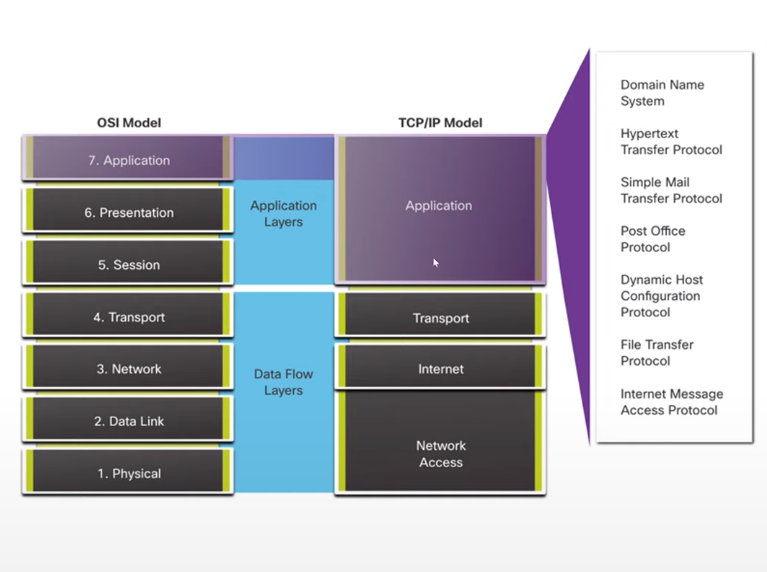

### Application layer

La capa de aplicación se encarga de ofrecer al usuario final una interfaz de comunicación hacia las demás capas, permitiendo ejecutar protocolos de red aquí, tales como HTTP, SMTP, FTP etc.

Es aquí donde se inicia la comunicación, conectando al usuario final mediante un programa con los protocolos y enviando la información a las siguientes capas.

Entonces el usuario abre su navegador, y escribe https://example.com lo cual crea una petición https por nosotros, y en este momento se accede a la capa de aplicación.

### Presentation layer

Esta capa se encarga de convertir la información a un formato leíble por otra entidad informática. Es decir que todo tipo de información que se inicia en la petición de la capa anterior debe ser debidamente formateada, codificada, convertida, en formatos transmisibles y entendibles por otro sistema.

Aquí se tratan temas complejos como las serialziaciones, conversiones de datos estructurados, representación de string. Tipicamente se realiza la encripción y desencripción de la información aquí, aunque también puede hacerse en otras capas.

Entonces el navegador inició nuestra HTTPS request y llegó aquí, donde es debidamente interpretada y convertida en formatos transmisibles y leíbles por nuestro servidor.

### Session layer

Esta capa se encarga de controlar la sesión entre dos aplicaciones, siendo la sesión la ocurrencia de solicitudes y respuestas.

Aqui encontramos los tipos de comunicación como simplex, half-duplex y duplex. Mecanismos como handshake, sincronización, reintentos, interrupciones etc.

### Transport layer

La capa de transporte es compleja y crítica. Se encarga de dividir nuestro tráfico en pequeños paquetes para que viajen a través de la red. Aqui se incluyen las tramas que identifican el tipo de tráfico que está viajando. Encontramos etiquetado TCP o UDP, para el caso de WIFI se agrega mucha mas información lo que se conoce como sobrecarga del protocolo, ya que la capa de transporte se encarga también de ordenar los paquetes que llegan o se envían.

### Network layer

La capa de red se encarga de descubrir las rutas, los routers, el camino que debe transitar nuestra información. Aqui se involucran los demás elementos de la red y la forma en que todo interactua.

Es decir, no es que las capas funcionen dentro del host como tal, al contrario, la descripción de la capa y de el modelo describen el comportamiento general de todo el sistema de comunicación como un todo. Es por eso que es importante entender que en la capa de red se incluye todo el tema de switching, routing etc.

### Data link layer

