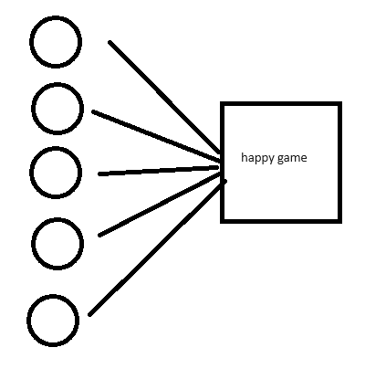
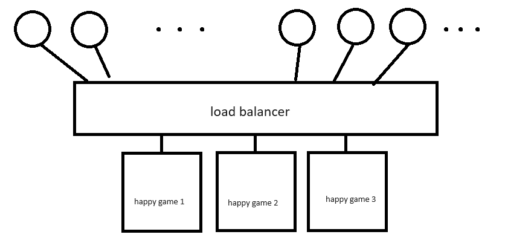

https://www.youtube.com/watch?v=bCS9m5RVPyo

# AWS Load balancers

Imaginemos que creamos un juego el cual desplegamos en AWS. Nuestra aplicación vive en una instancia de EC2.

Hasta hoy solamente hay 5 jugadores activos, que utilizan los recursos al mismo tiempo. Pero a medidad que pasa el tiempo nuestro juego se vuelve cada vez mas popular, y ahora cientos de usuarios están utilizando los recursos de nuestra instancia.

Aunque son buenas noticias, debemos solucionar algo porque al incrementar la cnatidad de solicitudes nuestro servicio se vuelve cada vez mas deficiente, tiempos de respuesta peores debido a la cantidad de **tráfico**.

Entonces lo que hay que hacer es replicar las instancias de EC2 de nuestra aplicación y poner en frente un balanceador de carga.

Como vemos, los usuarios en lugar de acceder a las isntancias de EC2, acceden al load balancer. Ahora es responsabilidad del balanceador el repartir las requests y el trafico a las instancias.

---

## Tipos de balanceadores

Recordando las clases de redes, sabemos que las comunicaciones se dan a través de protocolos que fluyen a través del modelo OSI.

Los balanceadores de carga se enfocan en alguna de ellas. Por ejemplo

- Aplication Load Balancer actúa sobre la capa 7, capa de aplicación
- Network Load Balancer actúa sobre la capa 4, capa de transporte

## Application load balancer ALB

Aqui nos fijamos directamente en el protocolo. Supongamos que hacemos una petición a https://example.com. Aqui podremos extraer mucha información de la petición al interrceptarla, por ejemplo: host, path, domain, headers, ratio etc. Con esta información el balanceador puede dirigir el tráfico a un grupo de servidores.

Este tipo de balanceadores es costoso ya que tiene muchas capacidades de manejo, dado que se puede interceptar la petición HTTP y hacer muchas cosas con la información.

## Network load balancer

Dado que este balanceador actúa sobre la capa de transporte, y como sabemos, esta se encarga de dividir la información en paquetes y se asegura que la data se transmita entre el cliente y el servidor sin errores. 

El balanceador se encarga de que haya baja latencia, alta transmisión de datos etc. Este tipo de balanceadores es común verlo en servidores de juegos y servicios de streaming, realtime etc.

Entocnes el balanceador decide hacia donde va el tráfico, velando por las características de capa 4.

---

Algo importante es el mecanismo de balanceo, hay cientos de formas de hacerlo. Pero aquí lo importante es tener en cuenta que para el ALB nuestras peticiones pueden enviarse a distintos servidores dependiendo de los headers, domain etc. En cambio, para el ejemplo de streaming con el NLB se esperaría que para cada usuario el balanceo se diera para un servidor en cada caso, distruyendo a los usuarios en los servidores disponibles.