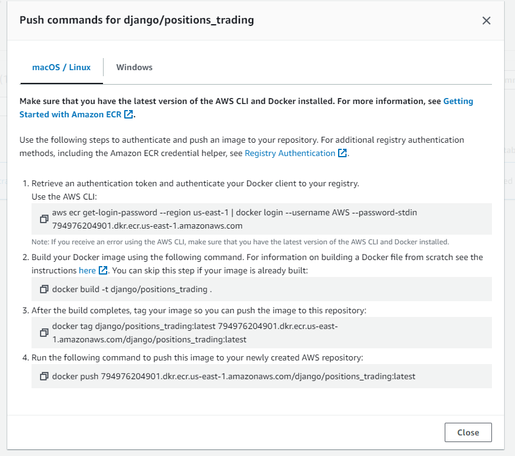

# ECR

Creamos un repositorio. Esto funciona similar a dockerhub.com, donde almacenamos imágenes de docker, tags etc.

Para crear nuestro vamos a ECR

1. Podemos seleccionar Público o privado, esto afectará los límites para el pricing
2. Le ponemos algún nombre y lo creamos

Ahora hay algo muy importante, debemos configurar nuestro AWS CLI. Entonces hay varios métodos, pero en este caso haremos el antiguo, es cual es mas facil xd

1. Vamos a IAM y seleccionamos uno de nuestros usuarios
2. Vamos a Security Credentials y creamos un access key
3. Descargamos el csv y lo mantenemos en un lugar seguro por ahora

Ya que utilizaremos estas llaves para iniciar sesión desde nuestra terminal. Entonces tenemos que instalarla [así](https://docs.aws.amazon.com/es_es/cli/latest/userguide/getting-started-install.html).

Le damos `aws --version` para verificar que quedó bien instalada. Ahora tenemos que iniciar sesión. Como vamos a hacerlo por el método facil entonces 

1. Escribimos `aws configure`
2. Nos pedirá las claves entonces las copiamos y pegamos y ahí quedaremos logueados
3. Podemos verificar por ejemplo ejecutando este comando para listar nuestros buckets de S3 `aws s3api list-buckets`

---

Ya tenemos configurada la terminal, entonces vamos a ECR y seleccionamos nuestro repositiorio, se iluminará un botón que dice **view push commands** y ahí saldrá algo parecido a esto

Entonces seguimos las instrucciones y nuestra imagen debería subirse sin problemas. Después podremos ir a ECS para hacer lo que nos de la gana con nuestra imagen xdd