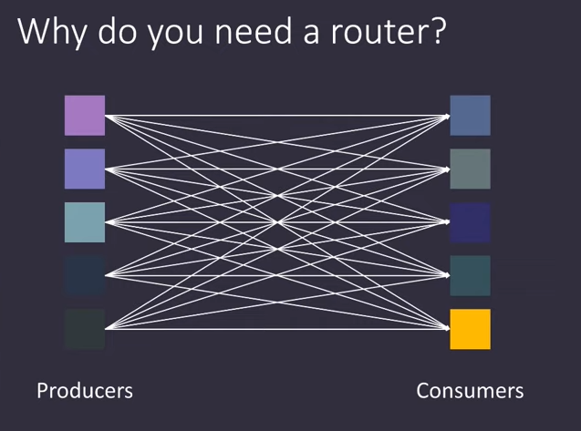
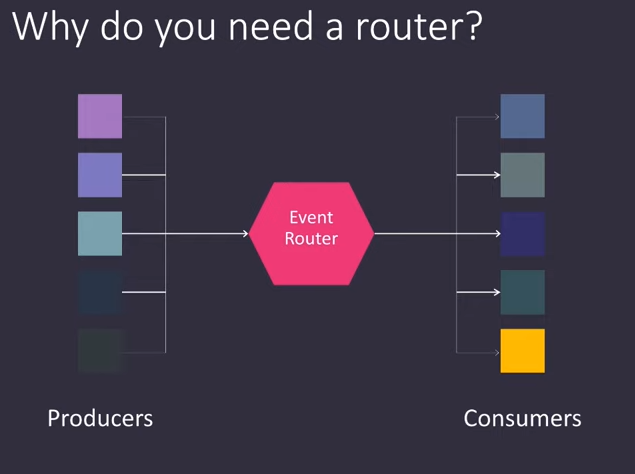
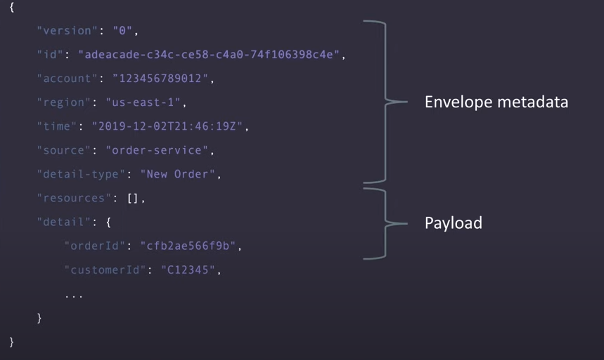
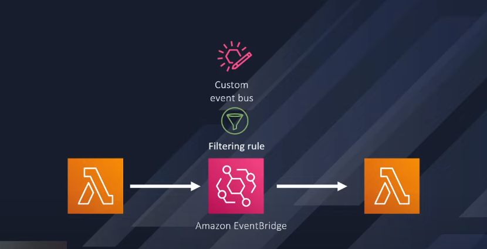

# Event Bridge

https://www.youtube.com/watch?v=TkU1RS5Fw1o


Diferencias SNS SQS EventBridge
- https://www.youtube.com/watch?v=Id2IVs1f7S0
- https://www.youtube.com/watch?v=RoKAEzdcr7k


Esto surge de la arquitectura orientada a eventos.

Hay entidades que reportan eventos cuando hacen algo, y otras que escuchan esos eventos y hacen algo. Productor y consumidor.

Como vemos en la imagen, si nuestra cantidad de productores y consumidores crece, lo hará también la cantidad de conexiones, lo cual resulta en algo muy dificil de mantener.



Hay una solución bastante vieja que consiste en poner un router en el medio para desacoplar los productores de los consumidores y centralizar las conexiones en un solo lugar. El problema es que si ese router se caía todo dejaba de funcionar



Sin embargo amazon administra el router y de alguna forma hace que sea resiliente y confiable.

---



Podemos observar la estructura de un mesaje que viaja por eventBridge. Este tiene una estructura especifica de envoltura, y en la clave "detail" agregamos nuestra información, la cual a su vez **utilizaremos para filtrar** nuestro contenido y llamar los servicios que les interese ese contenido en especifico, en otras palabras **hacer el routeo**

Los eventos permanecen en el bus por un periodo configurable de tiempo 

---

vamos a crear una arquitectura pequeña como esta



Nuestra primera lambda va a tener este código, el cual lo único que hace es enviar un body al bus de eventos.

```python
import json
import boto3
import datetime

client = boto3.client("events")

def lambda_gandler(event, context):
    response = client.put_events(
        Entries=[
            {
                "time": datetime.datetime.now(),
                "source": "Lambda Publish",
                "resources": [],
                "detailType": "Custom event demo",
                "detail": json.dumps({
                    "name": "alice",
                    "salary": 58000,
                    "married": "true",
                }),
                "eventBusName": "MY_BUS_ARN",
                "traceHeader": "testdemo"
            }
        ]
    )
    return response

```

Dentro del bus queremos filtrar el campo "married", si es true llamamos nuestra otra función lambda la cual está escuchando los eventos.

# Ahora un poema

1. Creamos nuestras funciones lambda, asegurándonos que la primera tenga los permisos en el rol que le es asignado al crearse
2. Creamos nuestro bus con un nombre cualquiera
3. La magia son las reglas, entonces una vez creado vamos a rules y le ponemos un nombre
4. Para este caso creamos un custom pattern con lo siguiente

    ```json
    {
        "detail": {
            "married": ["true"]
        }
    }
    ```

    de esta manera el target va a ser invocado unicamente cuando la regla se cumpla
5. Luego seleccionamos el target, en este caso será nuestra función lambda
6. Agregamos tags y esas cosas si queremos, luego click en crear

Si nos fijamos en nuestra segunda función lambda, al haberla seleccionado como target, en su trigger aparecerá nuestro EventBridge. Y eso es todo, al ejecutar nuestra primera función con "married" en "true" se activará nuestra segunda función.

Finalmente es importante resaltar que este servicio puede conectarse con otras cuentas de AWS e incluso con otras plataformas externas que emitan eventos, podemos verlas en la sección de integration.