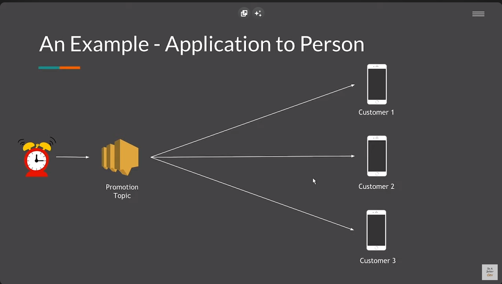
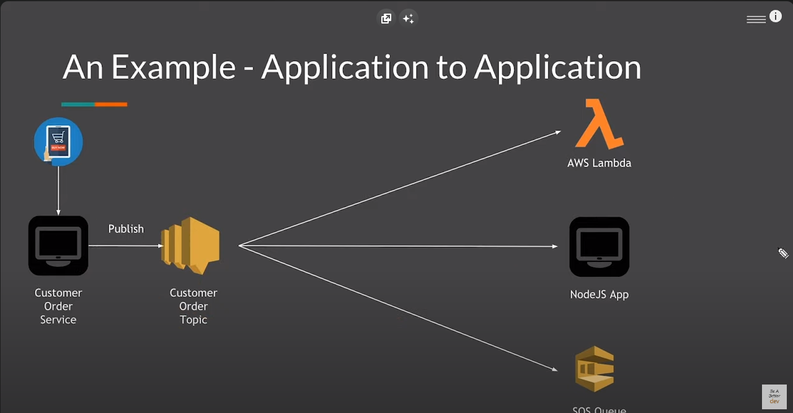
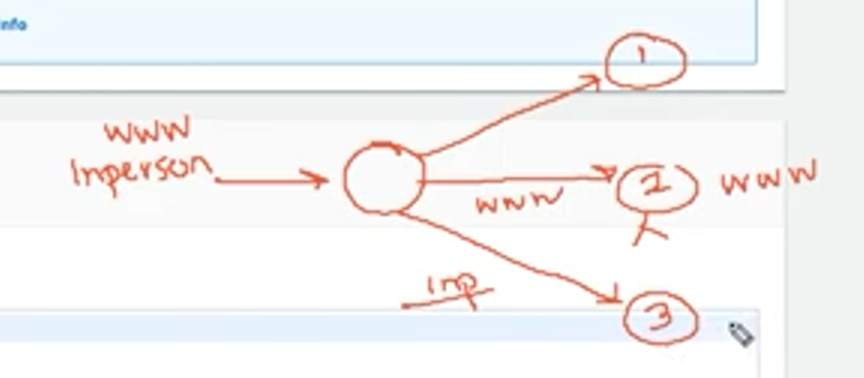

servicio de mensajería adminsitrado por AWS que nos permite comunicarnos entre distinas aplicaciones. Creacion de topics o temas y enviar SMS o emails cuando haya un error u ocurra algún evento.

Se basa en publicador y consumidores. Es una relación de uno a muchos, donde el publicador crea un topic y lo envia a todos los consumidores.

Aunque parezca que solo sirve para enviar emails o SMS, es posible configurar además de mensaje aplicación-persona, app-app.

En este ejemplo vemos una campaña publicitaria que se debe enviar a los usuario que tenemos registrados, algunos proveyeron sus números telefónicos y otros solamente el email. Queremos que una fecha especifica active nuestro servicio de mensajería.

Ahora vemos el ejemplo de comunicación entre apps o servicios. Nuestro ecommerce recibe una compra de cierto artículo y se ve reflejada mediante el llamado HTTP. Este publicará el evento a SNS, con detalles de la compra como el tipo de producto, la cantidad etc. Con esta información queremos realizar otras acciones como BI, Analytics etc. entonces, como podemos ver, podemos comunicarnos por ejemplo a Lambda, otra app u otro servicio de AWS.

---

### Topics

1. Entramos a nuestra hermosa consola y damos click en crear topic
2. Elegimos un nombre y un alias el cual se muestra a los usuarios finales.
3. Podemos habilitar encriptación, esto es especialmente util cuando se transmiten datos sensibles por medio de la red. Por ejemplo en el escenario del ecommerce
4. la seccion de **access policy** es MUY importante porque por defecto dice "_This policy defines who can access your topic. By default, only the topic owner can publish or subscribe to the topic._" Entonces es conveniente configurar dependiendo de los servicios o cuentas que queremos integrar a nuestro topic. Podemos poner Everyone pero solo para efectos de testing
5. Podemos configurar la política de reintentos en caso de que nuestro receptor por algún motivo no esté disponible, por ejemplo un teléfono apagado o sin conexión a internet. Aqui es posible establecer cuantos reintentos, el delay entre cada uno de ellos etc. [Aqui](https://www.youtube.com/watch?v=6OB6XF9MDbU&list=PL9nWRykSBSFg-CziAHKjr0XnvghEVkpFi&index=5) está una explicación de cada campo
6. Finalmente podemos configurar logs en cloudwatch, pero hay que tener especial cuidad aquí, ya que el envio de mensajes es masivo y si configuramos los logs para cada uno esto **incrementará nuestros costos dramáticamente en cloudwatch**

### Subscriptions

1. Una vez creado el Topic lo seleccionamos y damos clic ken create subscription
2. Aqui seleccionamos el protocol, dependiendo de la opcion saldra configuración adicional
3. En subscription filter policy hay algo muy importante que nos puede ahorrar costos. Sunpogamos este esquema 

Tenemos un topic y 3 subscribers, el numero 1 le interesa recibir todo el tráfico, el número 2 es una lambda y sabemso que cuesta dinero, a esta función solo le interesa el evento www, por lo cuál si manejamos con un `if event === "WWW"` estaremos desperdiciando presupuesto en llamados que no se van a ejecutar. Lo mismo ocurre con el subscriber 3, el cual solo le interesa el evento inperson.

---

Una vez creadas todas estas cosas vamos a topics lo seleccionamos y le damos a publish message. En el ejemplo de SMS recibiremos lo que pongamos en el formulario.