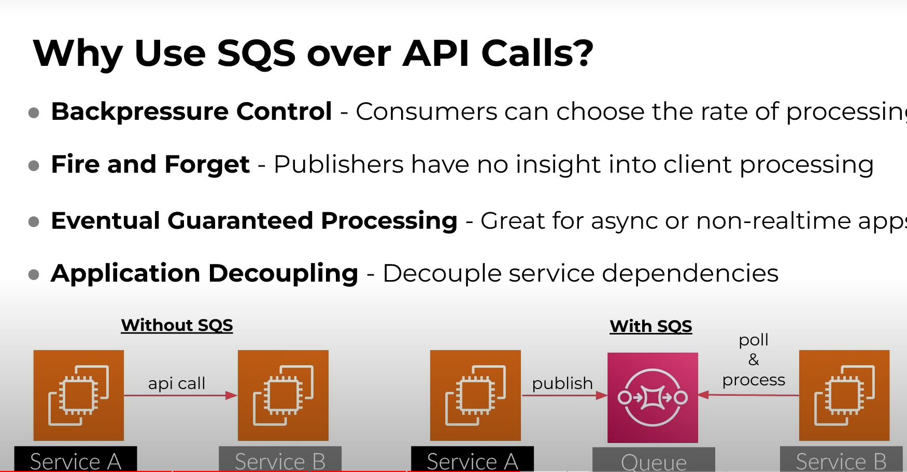

# SQS

Servicio simple de colas. Ofrece una comunicación basada en mensajes asíncronos, dando una alternativa al tradicional APi call. Con SQS se puede notificar asíncronamente a otro servicio de que algo cambió, desacoplando ambos servicios.

Imaginemos un conjunto de dispositivos IOT los cuales producen muchos eventos y queremos procesarlos.

El concepto de cola permanece igual, lo que primero entra es lo primero que sale. Dentro de la cola se almacenan mensajes con la información relevante. Los producers encolan y los consumidores desencolan, sin necesidad de que el emisor sepa si se entregó, porque esto **favorece** los procesos asíncronos y es el emisor **quien se encarga de extraer los mensajes de la cola**. 

Este ejemplo es de un ecommerce, donde le servicio de ordenes realiza operaciones cuando un cliente compra algún producto. Podemos pensar en que este servicio guarda información en la base de datos, genera algún reporte, etc. Naturalmente podríamos comunicar directamente con el servicio de analytics pero podemos utilizar la cola para simplificar este proceso.

Aquí a medida que el servicio de órdenes genera una nueva, la cola se encarga de que el consumidor la reciba y realice sus tareas.

Este esquema incluso se puede mejorar agregando SNS, para que el mensaje se envie a varias colas al mismo tiempo y pueda procesarse en paralelo.

---

- Una de las principales características es que SQS se encarga de que solamente un consumidor procese el mensaje que está para desencolar.

- varios hilos/procesos pueden solicitar de la cola, pero solo uno puede procesar el mensaje a la vez. Cuando el mensaje es asignado a un proceso este entra a un estado bloqueado, si el proceso no puede completar el mensaje este volverá a la cola. El estado bloqueado está dado por el tiempo de visibilidad.

- Cuando la cola está vacía aparece el concepto de long time period response, ya que el consumidor estará preguntando a la cola cada cierto tiempo si tiene mensajes pendientes. Este es un aspecto importante y que se puede configurar cuando estamos creando la cola.

- Si hay algún mensjes que ha dado error al procesar mas de las veces que hemos configurado, podemos también habilitar Dead-letter queue, la cual se encarga de almacenar aquellos mensajes que están dando problemas. Subsecuentemente podemos generar una alarma del tamaño de esa cola, ya que podría significar un error grave. Si nuestra aplicación falló en despachar un mensaje mas de 3 veces (por ejemplo), debemos corregir y para eso es util tener la alarma.

---

y aquí viene la magia de esto

en el ejemplo sin SQS, si el servicio B se cae el A también lo hará, ya que está esperando la respuesta del otro servidor. Sin embargo utilizando SQS, hay un man in the middle y este tiene todo el registro publicado por el servidor A. Ambo9s están desacoplados, eso quiere decir que ni el A ni el B tienen conocmiento del otro, solamente de la cola, es por eso que si uno de los dos cae, el otro no lo hará.

### Arquitecturas comunes

