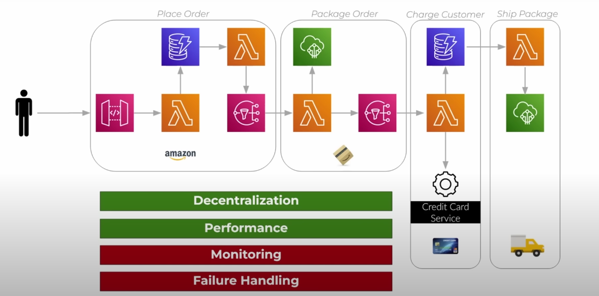
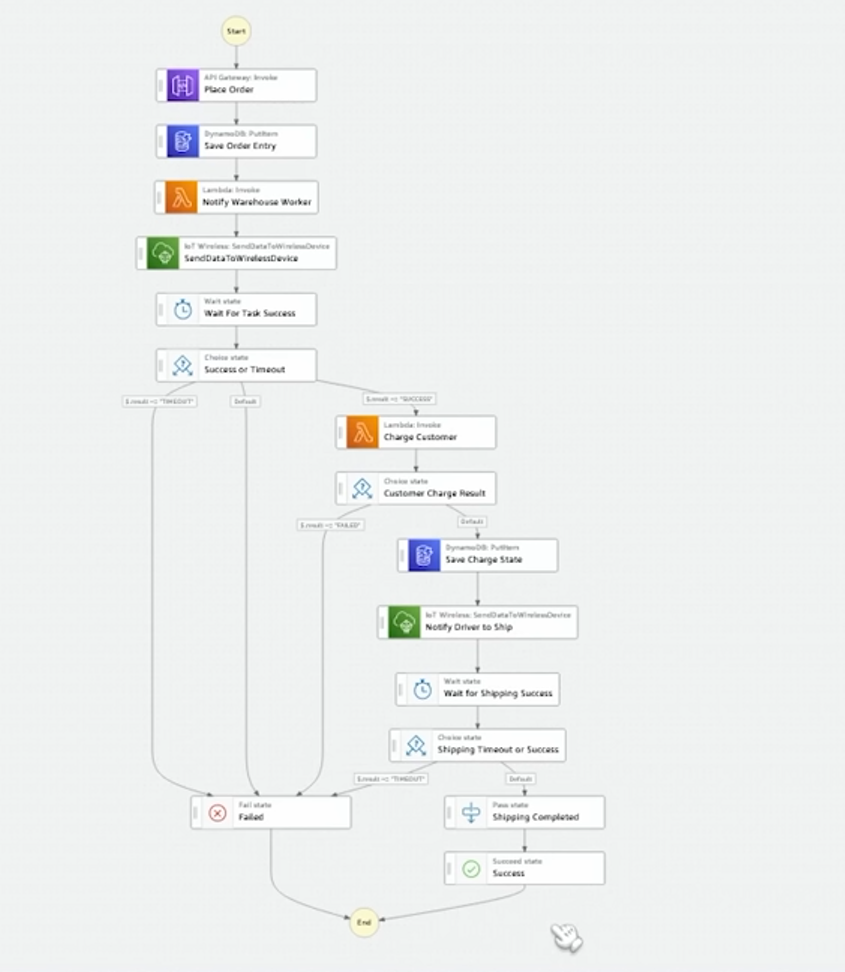

# Step Functions

Son un servicio gestionado por AWS para crear maquinas de estado y transiciones, para orquestar/coordinar nuestros servicios.

Esto es especialmente necesario para las aplicaciones serverless, ya que en muchas ocasiones necesitamos ejecutar código secuencial, es decir, una vez se complete una tarea el resultado va a ser enviado a otro servicio que va a procesar esa entrada, para generar una nueva salida y enviarlo así a otro servicio etc.

**Obviamente** estos estados y transiciones se puede hacer por medio de código en una aplicación monolítica, sin embargo existe el tema del acoplamiento. Cambiar una parte tendría un costo mayor, ya que en la versión serverless solamente hay que respetar la entrada y la salida y nuestro componente se podría reemplazar facilmente, además de que la app monolítica al sufrir una caída rompe todo el sistema. Step functions cuenta con sistemas de reitentos etc.

---

Esta es una arquitectura totalmente posible de hacer a punta de SNS y SQS. Si bien tiene como ventajas la descentralización y el agrupamiento en "equipos de trabajo" por ejemplo, un equipo de encarga del código de place order, otro de package order etc. También de alguna forma la simplicidad y la libertad de meter y sacar cosasm, utilizando servicios de bajo nivel como SNS y SQS.

Sin embargo falla en la captura de errores y el monitoreo de nuestras peticiones a lo largo de la arquitectura

aqui tenemos la versión en StepFunction, la cual funciona como un diagrama de flujo. Tenemos algunas condiciones, timers ETC...

soluciona el problema de la trazabilidad/monitoreo y el manejo de errores, ya que estos caen a algun estado en el diagrama y podemos facilmente poner una lambda que lo maneje.

Como todo tiene un precio, exactamente ese es uno de los inconvenientes de utilizar el StepFunction, ya que cuesta mucho mas que utilziar servicios de bajo nivel. También no es tan claro ver las partes de la aplicación como en la arquitectura