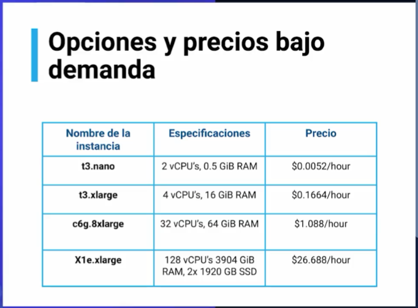
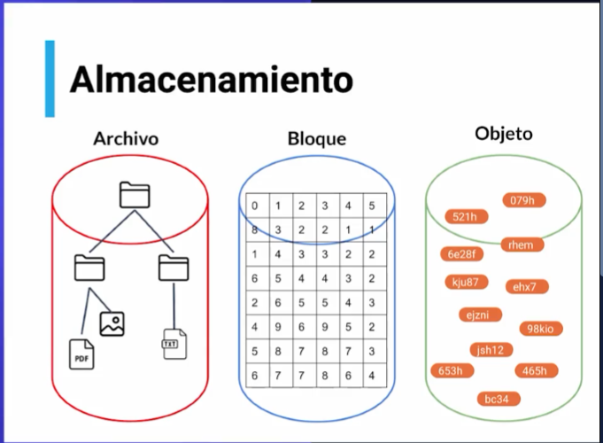

### Instancias
##### Elastic Computed Cloud (EC2)
- Amazon EC2: Maquinas virtuales seguras y redimensionables
- Amazon EC2 Spot: Cargas de trabajo tolerante a fallas, por hasta el 90% del precio normal
- Amazon EC2 AutoScallin: agregar o eliminar la capacidad informática para satisfacer tus necesidades en demanda
- Amazon EC2 LightSail: (Plataforma en la nube para crear una aplicación o un sitio web)

### Contenedores
- Amazon Elastic Container Services (ECS): servicio para correr contenedores, confiables y escalables
- Amazon Elastic Container Registry (ECR): servicio para almacenar, administrar, e implementar imágenes de contenedores
- Amazon Elastic Kubernetes Service (EKS): servicio de kubernetes
Serverless
- Amazon Lambda: servicio que nos permite ejecutar código sin servidores

### Edge
##### Servicios de borde
- Amazon Outposts: Ejecutar los servicios de AWS en nuestros propios servidores en lugar de Amazon
- Amazon Snow Family: Servicio que te permite tener una gran cantidad de datos, tiene discos desde el tamaño de un disco duro portátil hasta un semirremolque completo lleno de discos de almacenamiento. La familia de Snow tiene una solución útil que tenga que pasar a la nube
- AWS Wavelength: Servicio que permite acceder a los servicios AWS desde dispositivos 5G sin tener que acceder por internet (muy rápido)
- VMWare AWS: Migrar carga de trabajo de VMWare
- AWS Local Zones: Ejecutar las aplicaciones a una latencia más cerca de los usuarios finales

# EC2 Elastic Compute Cloud
- Permite alquilar computadoras virtuales.
- Diferentes tipos de EC2 con diferente CPU (para alto rendimiento), RAM y almacenamiento (para grandes cargas de trabajo).
- Instancias optimizadas en computación (para leer y escribir muy rápido)
- El sistema de pago más común: paga por hora o segundo, dependiendo el tipo de instancia

# Amazon elastic container service ECS
- Permite gestionar el uso de contenedores tipo docker 

# AWS Lambda

Servicio informático sin servidor que ejecuta su código en respuesta a eventos. Por ejemplo, subes una imagen y el lamba crea varias resoluciones.

Facturacion por milisegundos. El precio depende del uso de RAM

---

# Almacenamiento

- Archivo, organizador por carpetas y subcarpetas (sistema de ficheros) **Amazon Elastic File System (EFS)/ Amazon FSx for Window File Server**
- Bloque, los archivos se almacena en volúmenes por fragmentos de datos de igual tamaño, sin procesar: **Amazon Elastic Block Store (EBS)**
    - Bases de datos
    - servidor de correo electrónico
- Objetos, la información almacenada recibe un identificador único y se almacenan en un sistema de memoria plana: **Amazon Simple Storage Service (S3)**

# Respaldo
- Amazon Backup

# Transferencia de datos
- AWS Storage Gateway: es un conjunto de servicios de almacenamiento en la nube híbrida que le brinda acceso en las instalaciones al almacenamiento en la nube prácticamente ilimitado
- AWS DataSync: es un servicio seguro en línea que automatiza y acelera el traslado de datos entre las instalaciones y los servicios de almacenamiento de AWS
- AWS Transfer Family: escala de forma segura sus transferencias recurrentes de archivos de empresa a empresa a Amazon S3 y Amazon EFS con los protocolos SFTP, FTPS y FTP

---

# S3

> Generador de políticas: https://awspolicygen.s3.amazonaws.com/policygen.html

Almacenamiento de objetos. Garantía de no perdida del 99.999999999%

- S3 Standard: ofrece almacenamiento de objetos de alta durabilidad, disponibilidad y rendimiento para datos a los que se obtiene acceso con frecuencia
- S3 Standard-IA: Acceso poco frecuente, se utiliza con datos a los que se obtiene acceso con menos frecuencia, pero que requieren un acceso rápido cuando es necesario
- S3 Zone-IA: Acceso poco frecuente se usa con datos a los que se obtiene acceso con menos frecuencia, pero que requieren un acceso rápido cuando es necesario. A diferencia de las demás clases de almacenamiento de S3, que almacenan datos en un mínimo de tres zonas de disponibilidad (AZ)
- S3 Glacier: clase de almacenamiento de archivos que ofrece el almacenamiento de menor costo para los datos de larga duración a los que rara vez se accede. Se tarde entre 12h y 48h para su recuperación. $1/TB/month
- S3 Glacier Deep Archive: es la clase de almacenamiento más económica de Amazon S3, y admite la retención a largo plazo y la conservación digital de datos a los que se accede una o dos veces al año
S3 Intelligent-Tiering es un nuevo tipo de almacenamiento de Amazon S3 diseñado para los clientes que deseen optimizar los costos de almacenamiento automáticamente cuando los patrones de acceso a los datos cambian, sin afectar el rendimiento o la sobrecarga operativa

---

# Amazon Elastic File System (EFS)
Brinda un sistema de archivos de red, que permite acceder a archivos y directorios que no están en el sistema pero están conectados en la red. 

- Altamente disponible y duradero.
- EFS ha incorporado protección contra una interrupción de la zona de disponibilidad
- Tipos: brinda un sistema de archivos elástico sencillo, sin servidor y práctico. Sin tarifa mínima ni cargo de contratación.
        - Standar
        - Standar IA: Acceso poco frecuente
- Escala a medida que se agregan o eliminan archivos, lo cual evita la administración del disco
- Encriptación de forma predeterminada

---

# AWS Storage Gateway
Brinda acceso a almacenamiento en la nube prácticamente ilimitado desde nuestra propia infraestructura.

- File Gateway: Te brinda interfaces SMB y NFS para amazon S3, tanto en windows como en linux. Gracias a esto podemos guardar archivos a S3 como si se tratara de guardar archivos locales. Los archivos S3 luego pueden ser usados por cualquier servicio de AWS.
- Tape Gateway: Migrar copias de seguridad o respaldo
- Volume Gateway: en bloque iSCSI , tanto almacenado como en caché. Con baja latencia.

---

