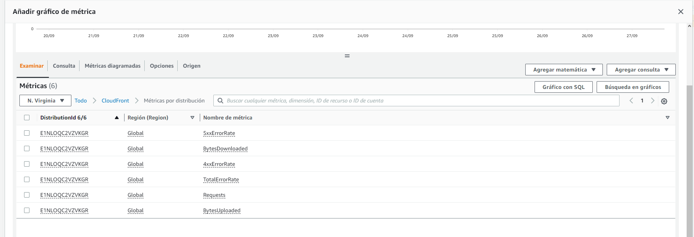
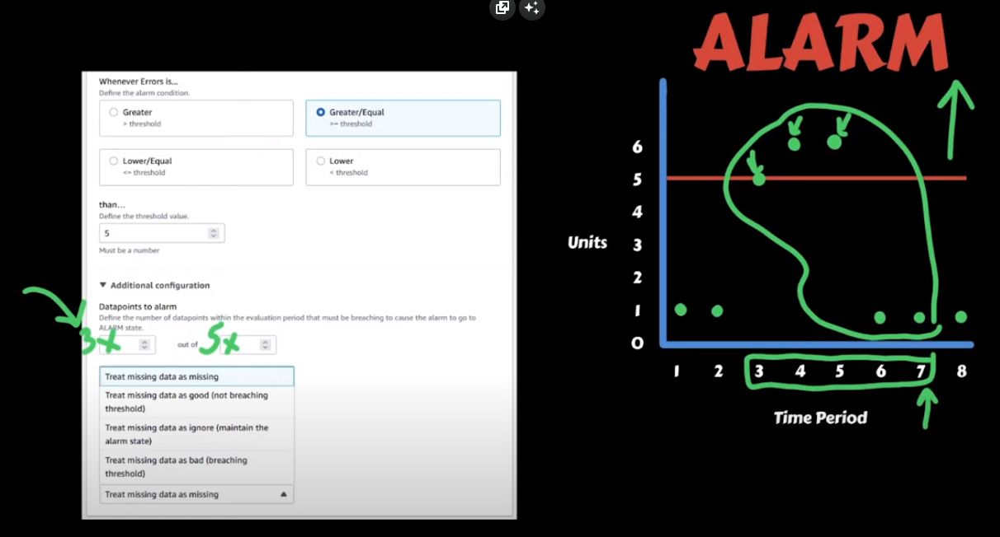

# Dashboard
1. Click en paneles y crear panel
2. Elegimos los widgets de nuestro interes
3. Para este ejemplo elegiremos el widget Line
4. Seleccionamos la metrica que queremos monitorear, es posible seleccionar metricas o logs, en este caso seleccionaremos metricas ya que es mas adecuado para un grafico de lineas
5. En browse buscamos el recurso de s3 de nuestro interés. En este caso quiero ver la cantidad de requests realizadas a mi CouldFront, entonces lo buscamos y seleccionamos

6. Es posible seleccionar varias metricas en el mismo grafico
7. Podemos editar el grafico cambiando la estadistica, el color, periodo etc. en la pestaña graphed metrics
8. Algo muy util es agregar anotaciones al grafico, por ejemplo el umbral aceptado para cierta metrica, para esto vamos a la pestaña annotations y agregamos una nueva anotacion
9. Se posible configurar el refresco automático en el desplegable de la parte superior derecha, al lado del botón de refresh
10. En acciones podemos cambiar el marco de tiempo de la metrica en Period override

# Alarmas
1. Nos dirigimos a la pestaña de alarmas
2. Seleccionamos la métrica que queremos alertar, y configuramos la estadística y el periodo que queremos medir
3. En la pestaña de condiciones configuramos la condición que queremos alertar, en este caso si el promedio de requests es mayor a 1000 en 1 minuto
4. Para la configuración adicional hay algo importante. El input de la izquierda representa el numero de data points y el de la derecha el evaluation period. Hay que tener en cuenta el periodo de tiempo que elegimos al principio (supongamos un minuto), significa que cada minuto nuestra alarma va a ser evaluada. Sin embargo podemos darle algo de tolerancia a la alarma para que se active después de que pasen varios periodos de evaluación con la condición cumplida.

En la imagen estamos con una ventana de tiempo de 5 minutos y para que se active la alarma se debe cumplir la condición para 3 data points. (que se cumplan **3 de 5**)
5. Es posible que halla missing data, debido a la no utilización de los recursos (por ejemplo una lambda). Para esto tenemos varias opciones, ignorar, tratar como OK, mantener el estado de alerta etc.
6. Siguiente y nos preguntará cuando se activa la alarma, lo mas normal es que se active cuando se cumpla la condicion del umbral, es decir cuando entre el modo alarma, pero también se podría configurar para cuando esté en OK notifique.
7. podemos utilizar un [SNS](https://us-east-2.console.aws.amazon.com/sns/v3/home?region=us-east-2#/homepage) existente o crear uno nuevo con el correo para recibir la notificación. 
8. Podemos agregtar integraciones adicionales de EC2 y auto scalling
9. Finamente agregamos un nombre y descripcion para la notificación.
10. Podemos agregar esta alarma a nuestro panel de CloudWatch

# 