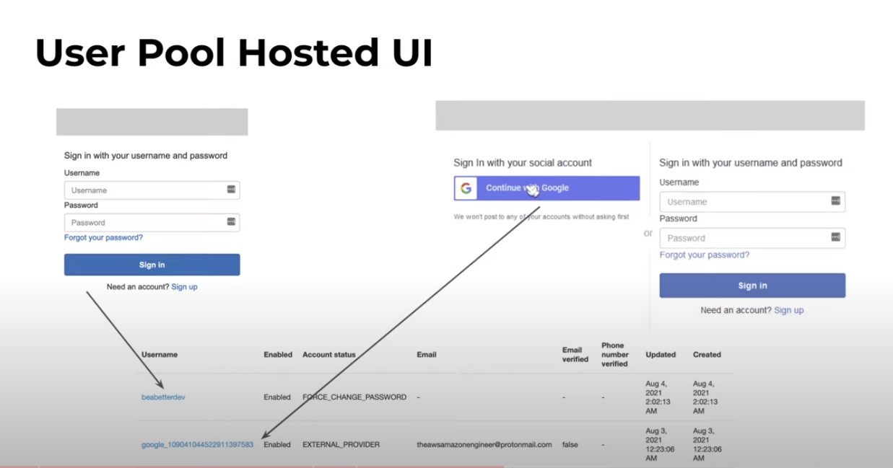

# Cognito

Es un servicio que oferece autentication y autorizacion. Autenticación es el proceso para identificar quien es la persona que está intentando ingresar (por ejemplo un formulario de login). Autorization se refiere a identificar un usuario a que tiene acceso (permisos).

### Conceptos clave

##### User pools

> Su principal función es manejar un directorio de usuarios 

Es posible utilziar user pools para autenticar con diversos protocolos, entre ellos el mas famoso OAuth2. Lo que significa que podríamos integrar algun inicio de sesión de google, facebook etc.

Entonces tenemos las dos opciones
- registrar los usuarios con sus crendeciales en cognito
- utilziar un inicio de sesión de terceros, y cuando el usuario haga el proceso de login se creará ese usuario en cognito

##### Identity pools

> Proveen acceso de corto tiempo a servicios de aws

Depués de que el usuario se loguea accede a un conjunto de credenciales, o a un rol IAM que tiene acceso a algun servicio de aws.

En este punto podemos verificar los datos del usuario para saber que permisos darle, por ejemplo, si el usuario es de tipo administrador, entonces le asignaremos un rol donde pueda acceder a unos recursos mas específicos.

---

Una vez creado nuestro pool podremos utilizar el **User pool hosted UI**, que no es mas que un formulario por defecto que administra amazon para gestionar la autenticación. Lo único de lo que debemos preocuparnos es de proveer un url redirect para que volvamos a nuestra aplicación con el usuario ya autenticado.

También tenemos la opción de utilziar el aws SDK para llamar los enpoints de cognito y realizar a mano todo el flujo llamando los métodos de ingresar, registro, etc.

---

### Triggers

como muchos de los servicios, este también puede integrarse a aws lambda para gestionar los eventos. Por ejemplo un usuario se registró, entonces le envairemos un correo dándole la bienvenida 🙂