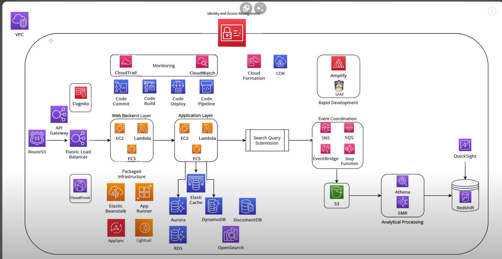
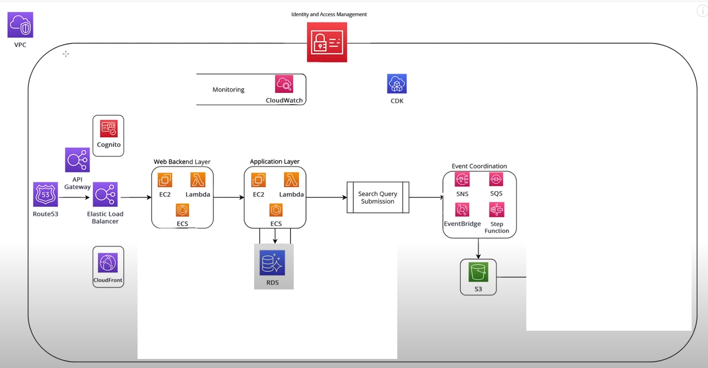

- [django_architecture](https://betterprogramming.pub/design-an-auto-scalable-architecture-for-your-django-apps-in-aws-850ca5ec63a1)
- [Serverless architecture](https://medium.com/serverless-transformation/what-a-typical-100-serverless-architecture-looks-like-in-aws-40f252cd0ecb)
- [Ejemplos_CDK](https://github.com/aws-samples/aws-cdk-examples/blob/master/typescript/static-site/static-site.ts)
- [serverless examples](https://github.com/amazon-archives/serverless-app-examples/blob/master/python/hello-world-python3/lambda_function.py)
- [aws-copilot-cli](https://aws.github.io/copilot-cli/)
- [service discovery](https://docs.aws.amazon.com/AmazonECS/latest/developerguide/service-discovery.html)
- [certification](https://aws.amazon.com/es/certification/)

---

- [aws practice exams](https://www.awsboy.com/aws-practice-exams/)
- [aws practice exams 2](https://aws.amazon.com/certification/certified-developer-associate/?c=sec&sec=resources)
- [aws practice exams 3](https://aws.amazon.com/certification/certification-prep/?nc2=sb_ce_ep)
