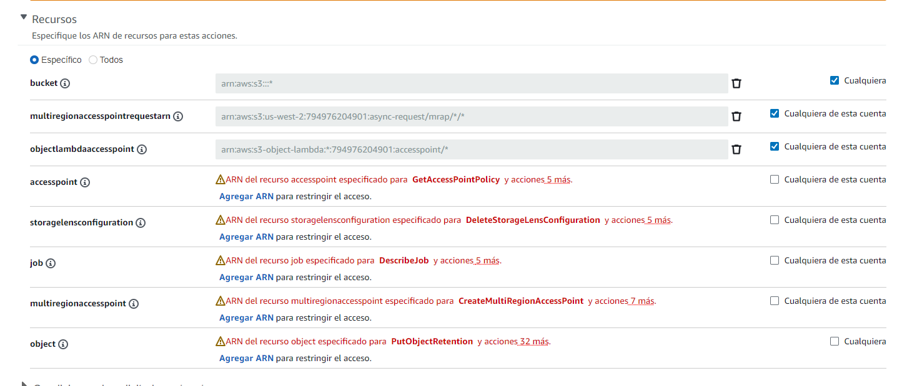
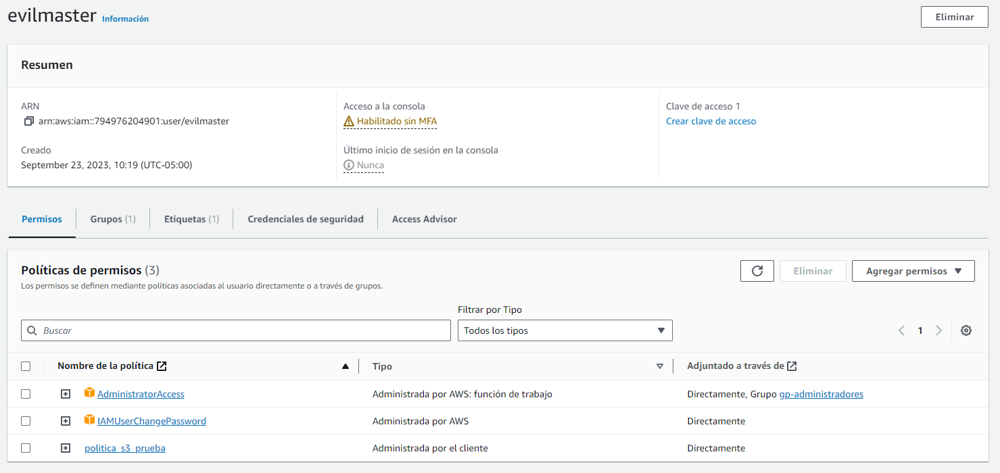

# Policies

Son un conjunto de reglas que se pueden especificar para describir las acciones que es posible aplicar sobre algún servicio de amazon

1. Entrando a IAM y dando click en policies en el menú izquierdo
2. Veremos una lista de policies creadas por amazon por defecto, es totalmente posible utilizar alguna de estas
3. También podemos crear una nueva dando click en Crear política
4. Seleccionamos un servicio y filtramos las acciones de nuestro interés
5. Para este ejemplo agregaré todos los permisos a S3
6. Veremos algunos permisos que requieren especificidad en su asignación. En la imagen vemos que por medio del [ARN](https://docs.aws.amazon.com/es_es/IAM/latest/UserGuide/reference-arns.html) podemos decir a cuales recursos en específico puede acceder esta policie 
7. Una vez seleccionadas las acciones, damos click en siguiente y asignamos un nombre a la policy.
8. Una vez creada la policy, podemos asignarla a un usuario, grupo o rol.

# Usuarios
1. Entrando a IAM y dando click en usuarios en el menú izquierdo
2. Crearemos un usuario dando click en agregar usuario
3. Asignamos un nombre y seleccionamos el tipo de acceso que tendrá el usuario
4. Para este ejemplo seleccionaremos "Quiero crear un usuario de IAM", lo cual nos dará la opción de generar una contraseña.
5. En la siguiente pantalla podemos las policies a un usuario en concreto, en este caso seleccionaremos la policy que creamos en el paso anterior y la policie por defecto AdminsitratorAccess.
6. Siguiente y podremos ver un resumen de la creación del usuario. También podemos agregar tags con iformación adicional.
7. Una vez creado el usuario, podemos ver su información y descargar un archivo con las credenciales de acceso.

# Grupos
Es conveniente poder generalizar los permisos de un conjunto de usuarios, para esto podemos crear grupos y asignarles policies.

1. Entrando a IAM y dando click en grupos en el menú izquierdo
2. Click en crear grupo y asignamos un nombre
3. Asignamos las policies a este grupo, en este caso seleccionaremos otra vez AdministratorAccess
4. Finalmente podemos seleccionar los usuarios que pertenecerán a este grupo
5. Alternativamente, podemos ir a usuarios y desde allí asignar un usuario a un grupo en la pesataña grupos.
6. Ahora nuestro usuario está creado con las policies de ambas fuentes, directamente y del grupo al cual pertenece, así como se ve en la imagen

7. Para este ejemplo AdministratorAccess estará duplicado y podemos eliminar la asignación directa, para dejar solo la del grupo.
8. Un usuario puede pertenecer a varios grupos lo cual se considera la practica recomendada.

# Password Policy (formato de contraseña)
Es una manera de establecer el formato que deben tener las contraseñas de los usuarios. 

1. Entrando a IAM y dando click en Configuracion de la cuenta en el menú izquierdo, y política de contraseñas 
2. Click en Editar y Seleccionamos las opciones que mas nos gusten 🙂

# Roles
Los roles son un conjunto de permisos que se pueden asignar a un servicio de amazon, por ejemplo a una instancia EC2, a un lambda, etc. Estos se pueden asignar de manera temporal, para que el servicio pueda realizar una tarea especifica y luego se le retiren los permisos.

# Buenas practicas
Se recomienda utilizar el usuario root solo para crear usuarios, grupos, roles y policies. Luego utilizar los usuarios creados para realizar las tareas de administración.

1. Ir al dashboard y editamos la URL de inicio de sesión para que se autocomplete el id de la cuenta en el formulario de incio. Para esto al personalizar nuestra url de acceso debemos poner en el id de la cuenta y guardar.
2. Ahora podemos acceder a la consola de administración con la url personalizada y el usuario administrador creado previamente. 
