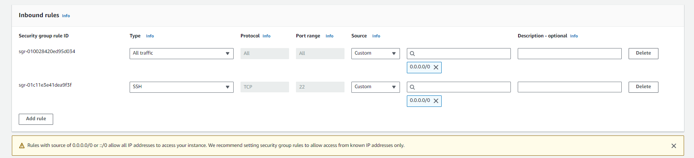
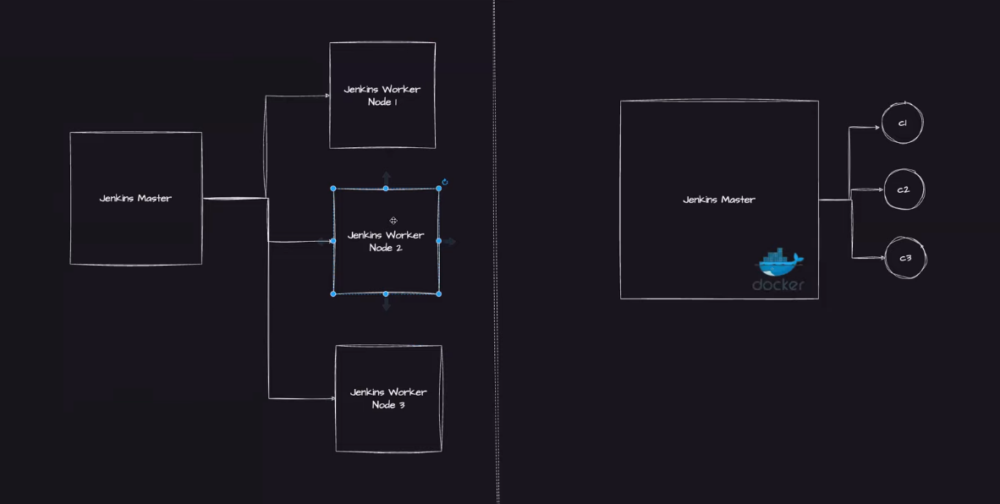

# Instalación

Hay muchas maneras de instalar esto, probé docker pero me dio muchos problemas, así que decidí irme a la fija e instalarlo en un server ubuntu de AWS

Creamos la isntancia asegurandonos de permitir el tráfico SSH y nos conectamos a ella

> ssh -i C:\Users\finanzas\Downloads\jenkins.pem ubuntu@3.88.154.42

Ahí tomamos el certificado y nos conectamos.

Ahora hay que exponer el puerto 8080 en el security group para poder ver la interfaz gráfica



en la instancia debemos instalar lo siguiente. La información la saqué de acá https://github.com/iam-veeramalla/Jenkins-Zero-To-Hero/blob/main/README.md

Pero todo esto está sujeto a las fechas. Es mejor siempre mirar la documentación oficial https://www.jenkins.io/doc/book/installing/linux/

```bash

sudo apt update
sudo apt install openjdk-11-jre

java -version

curl -fsSL https://pkg.jenkins.io/debian/jenkins.io-2023.key | sudo tee \
  /usr/share/keyrings/jenkins-keyring.asc > /dev/null
echo deb [signed-by=/usr/share/keyrings/jenkins-keyring.asc] \
  https://pkg.jenkins.io/debian binary/ | sudo tee \
  /etc/apt/sources.list.d/jenkins.list > /dev/null
sudo apt-get update
sudo apt-get install jenkins

```

finalmente como vamos a utilizar los docker pipelines vamos a instalar docker también

```
sudo apt update
sudo apt install docker.io

sudo su - 
usermod -aG docker jenkins
usermod -aG docker ubuntu
systemctl restart docker

reboot
```

---

Una vez instalado ponemos la contraseña para desbloquear que nos aparece en la ruta que dicen en la interfaz gráfica, seguimos el wizard con las cosas por defecto, llenamos el nombre contraseña etc. Hasta que lleguemos al panel principal.



jenkins funciona como una arquitectura maestro-esclavo, donde por defecto tenemos el nodo maestro. Sin embargo, en nuestra organización pueden existir diferentes equipos, desarrolladores, proyectos etc. por lo que el nodo maestro puede verse sobrecargado y tener problemas de conflictos entre paquetes y versiones.

Por eso es que aparece el concepto de nodos esclavos, en donde vamos a correr separadamente los jobs, por lo cual el nodo maestro vamos a destinarlo solo para porpósitos de agendamiento/orquestación.

En el diagrama de la izquerda podemos ver 3 nodos esclavos, en cada uno de ellos tenemos la configuración necesaria para correr los jobs de una app específica. Por ejemplo si estamos trabajando una versión de node específica el nodo1 tendra la versión X de node. El problema aparece cuando hay otro proyecto con una versión diferente.

Entonces al lado derecho vemos una arquitectura mas contemporánea donde los jobs corren en contenedores de docker, ya que con esta tecnología es mas facil gestionar las versiones y requerimientos para correr nuestros jobs.

---


Entonces

1. vamos a plugins e instalamos docker pipelines
2. reiniciamos jenkins (podemos ir a la ruta /restart)
3. vamos a nuevo, y crear pipeline
4. seleccionamos la opcion SCM = Git
5. Llenamos el formulario poniendo la URL del repositorio, el nombre de la rama y el Path del script donde se describen los pasos


para este ejemplo este es nuestro script. Este está dentro de alguna carpeta del repositorio


```
pipeline {
  agent {
    docker { image 'node:16-alpine' }
  }
  stages {
    stage('Test') {
      steps {
        sh 'node --version'
      }
    }
  }
}
```