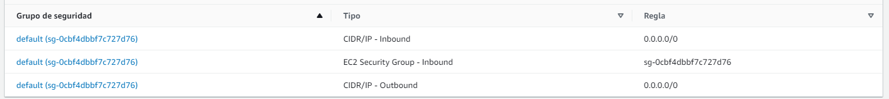
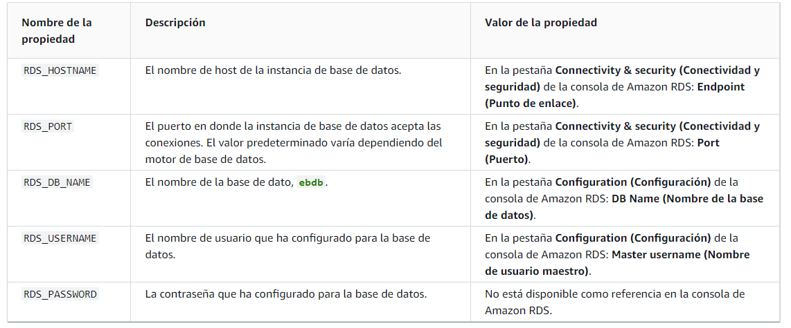

# Crear base de datos
1. Ingresar a RDS en amazon
2. Crear base de datos siguiendo las instrucciones de formulario
3. Es importante seleccionar las opciones de la capa gratuita según corresponda
4. Escribir la contraseña es importante ya que luego no podremos verla
5. Una vez creada la base de datos, ingresar a la misma y asegurarse que las reglas de seguridad permitan el acceso desde cualquier lugar, estos significa que tanto en las reglas de entrada como de salida se permita el tráfico desde 0.0.0.0/0

como podemos ver, en la imagen se muestra esta configuración tanto inbound como outbound
6. Una vez creada la base de datos, podemos ingresar a la misma y veremos la información de conexión

# Crear servidor en nuestro sistema gestor de base de datos
1. Ingresar a nuestro sistema gestor de base de datos
2. Crear un nuevo servidor
3. Ingresar la información de conexión que nos proporciona AWS
4. Aquí podemos ver la información requerida para la conexión

Por lo tanto en nuestro pgadmin o cualquier otro gestor, debemos ingresar la información.

# Ejemplo para django
1. Ingresar a nuestro proyecto django
2. Ir al archivo settings.py
3. En la sección de DATABASES, cambiar la información de conexión
```python
DATABASES = {
    'default': {
        'ENGINE': 'django.db.backends.postgresql',
        'NAME': os.getenv("NAME"),
        'USER': os.getenv("USER"),
        'PASSWORD': os.getenv("PASSWORD"),
        'HOST': os.getenv("HOST"),
        'PORT': os.getenv("PORT"),
    }
}
```
4. Crear un archivo .env en la raíz del proyecto
5. Ingresar la información de conexión
```python
NAME=nombre_base_datos
USER=usuario_base_datos
PASSWORD=contraseña_base_datos
HOST=host_base_datos
PORT=puerto_base_datos
```
6. En el archivo .gitignore agregar el archivo .env
7. En el archivo settings.py agregar la siguiente línea
```python
from dotenv import load_dotenv
load_dotenv()
```
