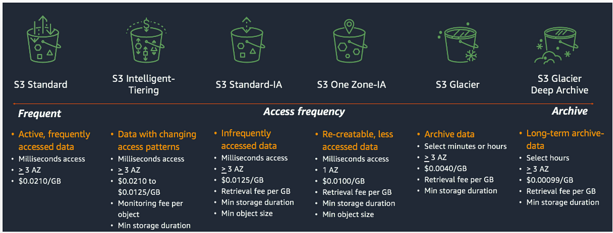

# S3 simple storage service

Se enfoca en almacenamiento general de objetos en la nube. Durable, escalable, disponible  y facil de integrar.

### Conceptos principales

- Un bucket es un contenedor de objetos dentro de un namespace. El nombre del bucket es unico en todo aws
- el object es la info que queremos guardar. Tiene un tamaño maximo de 5TB

El acceso al bucket está deshabilitado por defecto.

Podemos acceder a su contendo mediuante la URL o programaticamente.

### S3 Storage Classes

Esto reduce costos pero con algunos sacrificios

S3 cuenta con la opción de ir moviendo el contenido entre classes de s3 a medida que pasa el tiempo. Podemos configurar que pasados x días nuestra información vaya a glacier que ya va a ser infrecuentemente accedida (lifecycle rules)

https://aws.amazon.com/es/s3/storage-classes/

**Standard (STANDARD)**: Esta es la clase de almacenamiento predeterminada para S3. Ofrece una alta durabilidad y disponibilidad de los datos, diseñada para redundancia y replicación automática en múltiples instalaciones y dispositivos dentro de una región de AWS. Es ideal para una amplia variedad de casos de uso, incluidos el almacenamiento de datos empresariales, la distribución de contenido y las copias de seguridad.

**Intelligent-Tiering (INTELLIGENT_TIERING)**: Esta clase de almacenamiento utiliza machine learning para analizar patrones de acceso y mover automáticamente los objetos entre dos niveles de acceso, frecuente y no frecuente, con el objetivo de optimizar los costos. Es útil cuando no puedes predecir el patrón de acceso de tus datos y deseas una gestión de costos más automatizada.

**Standard-IA (INTELLIGENT_TIERING)**: Infrequent Access (IA) es una clase de almacenamiento que se utiliza para datos a los que se accede con menos frecuencia, pero que aún necesitan una recuperación rápida cuando se solicitan. Tiene un costo menor que la clase de almacenamiento estándar, pero cobra tarifas adicionales por recuperación.

**One Zone-IA (ONEZONE_IA)**: Similar a Standard-IA, pero los datos se almacenan en una sola zona de disponibilidad en lugar de en múltiples zonas. Esto hace que sea más económico, pero con una durabilidad menor ya que no ofrece redundancia en diferentes zonas de disponibilidad.

**Glacier y Glacier Deep Archive**: Estas clases de almacenamiento se utilizan para el archivado de datos a largo plazo con acceso eventual. Glacier ofrece opciones de recuperación en minutos a horas, mientras que Glacier Deep Archive se diseñó para datos que rara vez se acceden y puede tardar horas en recuperarse.

**S3 Replication Storage Classes**: Además de las clases de almacenamiento anteriores, puedes utilizar diferentes clases de almacenamiento para la replicación de objetos en otra región de AWS. Puedes replicar datos de una clase de almacenamiento en una región a otra con diferentes clases de almacenamiento según tus necesidades de rendimiento y costos en la región de destino.

Los costos son calculados en la cantidad de almacenamiento, numero de veces que se accede a los recursos y la transferencia fuera de aws

---

La **"duración mínima de almacenamiento"** se refiere al período mínimo durante el cual un objeto debe permanecer en una clase de almacenamiento específica antes de poder ser trasladado o cambiado a una clase de almacenamiento diferente sin incurrir en tarifas adicionales. En el contexto de Amazon S3, algunas clases de almacenamiento tienen requisitos de duración mínima.

Por ejemplo, en la clase de almacenamiento "Glacier", hay una duración mínima de almacenamiento que debe cumplirse para los objetos antes de que puedan ser recuperados. Si decides mover o eliminar un objeto antes de que expire ese período mínimo, es posible que se te apliquen tarifas adicionales o penalizaciones.