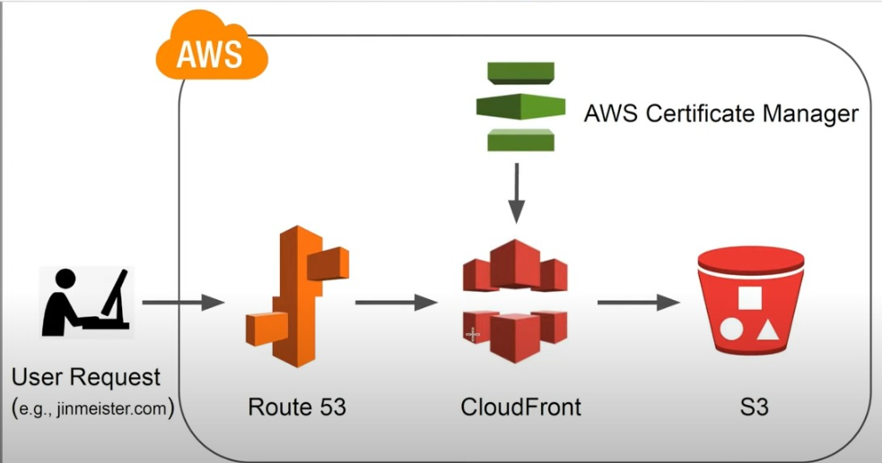

# S3
Utilizamos el servicio de S3 para almacenar los archivos de nuestro sitio web estático. Para este ejemplo utilizaremos React.

1. Generamos los archivos html, css y javascript utilizando
```shell
npm run build
```
2. Esto nos generará la carpeta build, la cual contiene nuestro sitio web.
3. Entramos a AWS S3
4. Crear nuevo bucket
5. Elegimos un nombre y una región. Algo importante es que el nombre **Debe coincidir con el nombre de nuestro dominio**
6. Dejamos las ACL deshabilitadas 
7. Desmarcamos la casilla de "Bloquear todo el acceso publico", y las subsequentes opciones. Todo debe quedar público
8. Le damos en crear
9. Una vez creado lo podremos ver en la lista, lo seleccionamos y vamos Propiedades
10. Buscamos la opción de "Alojamiento de sitios web estáticos"
11. Editar y habilitamos la opción de sitios web estáticos
12. Elegimos el nombre de nuestro index.html y error.html
13. Guardamos los cambios
14. Ahora vamos a la opción Permisos
15. Buscamos la opcion "Política de bucket" y le damos editar
16. Accedemos a esta web https://awspolicygen.s3.amazonaws.com/policygen.html y generamos la pólitica de nuestro bucket
17. Copiamos, y pegamos en la configuración de nuestro bucket
18. Guardamos los cambios.

En este momento ya es posible subir nuestros archivos al bucket, entonces procesdemos a copiar todo el contenido de nuestra carpeta **build** al bucket.

# Dominio + Route 53
Este paso se puede hacer de varias maneras. Podemos comprar nuestro dominio en cualquier proveedor o lo podemos hacer directamente en AWS con Route 53.

En este caso el dominio fue comprado en Google Domains. Entonces:

1. Vamos a Route 53
2. Zonas hospedadas y crear zona hospedad
3. Escribimos el nombre de nuestro dominio y le damos crear
4. Esto nos dará como resultado una lista de registros
5. Debemos fijarnos en los que son de tipo **NS**
6. Accedemos a google domains (o cualquier otro proveedor que hayamos utilizado)
7. Vamos a DNS, Servidores de nombres personalizados, gestionar
8. Aqui debemos copiar cada uno de los registros **NS** que obtuvimos al crear la zona hospedada en Route 53
9. Guardamos y activamos esta configuración por defecto

En este punto podríamos crear un registro que apunte directamente a nuestro bucket de S3

1. Volver a Route 53 y seleccionar nuestra zona hospedada
2. Crear un registro nuevo
3. Seleccionar Tipo de registro: A
4. Seleccionar alias
5. Dirigir el tráfico a punto de enlace del sitio web de S3
6. Automáticamente Route 53 va a encontrar nuestro bucket, ya que éste y nuestra zona hospedada tienen el mismo nombre

Esto va a funcionar y podríamos acceder a nuestro dominio y ver nuestro sitio web desplegado. Sin embargo éste quedaría con el protocolo **http://** y por motivos de seguridad lo mejor es habilitar **https://**

# Certificate Manager
Aquí podremos generar nuestro certficado para utilizar el protocolo **https://** a nuestro dominio, para eso:

1. Vamos a Certificate Manager
2. Seleccionamos Solicitar certificado
3. Solicitar un certificado público
4. En el nombre del dominio debemos crear tres registros
    - *.midominio.com
    - midominio.com
    - www.midominio.com
5. Dejamos el resto igual y click en solicitar
6. Esto nos creará un registro con estado "En espera"
7. Le damos click y vamos a la sección de Dominios
8. Damos click en Crear registros en Route 53 y en aceptar
9. Esto nos creará los registros en nuestra zona hospedada, podemos ir y verficar que nos creó dos registros de tipo **CNAME**, los cuales corresponden al certificado SSL
10. Debemos esperar unos minutos a que se valide el certificado y una vez salga el estado "Realizado correctamente" podemos continuar

# Could Front

Finalmente podemos completar la arquitectura. En este punto tenemos los modulos de S3, Route 53 y Certificate Manager. Con Could Front podremos integrar todo.

1. Vamos a Cloud Front
2. Crear distribución
3. Elegimos en el Origin domain nuestro bucket de S3. Esto significa que vamos a routear nuestro tráfico desde el could front a S3
4. Seleccionamos Redirect HTTP to HTTPS
5. Buscamos Alternate domain name (CNAME) y escribimos
    - *.midominio.com
    - midominio.com
    - www.midominio.com
6. Buscamos Custom SSL certificate y seleccionamos nuestro certificado creado con Certificate Manager
7. El resto queda igual
8. Click en create distribution

En este momento se creará nuestra distribución de Cloud Front. Si accedemos y entramos a General, copiamos el "Distribution domain name" y lo pegamos en nuestro navegador veremos nustro sitio web con **https://**. Eso es muy bueno, solo falta un paso

# Volvemos a Route 53
1. Accedemos a nuestra zona hospedada
2. Click en crear registro
3. Seleccionamos tipo de registro A
4. Habilitamos "Alias"
5. En "Dirigir el trafico a" seleccionamos Distribución de CloudFront
6. Y seleccionamos la distribución que creamos previamente
7. Guardamos y esperamos un momento mientras se propaga el DNS

De esta manera completamos nuestra arquitectura, como pudimos ver los módulos de S3 y CloudFront por si solos pueden servir el sitio web con sus direcciones específicas. Sin embargo nuestro resultado final es muy bueno, ya que utilizamos nuestro propio dominio el cual apunta a CloudFront donde usa el certificado SSL, y a su vez este apunta al bucket de S3 que contiene los archivos de nuestro sitio web.