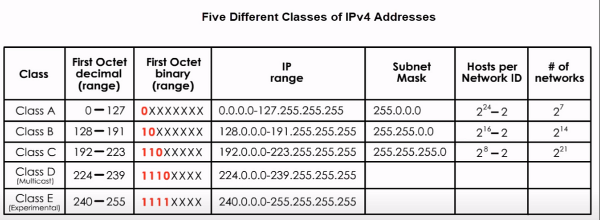
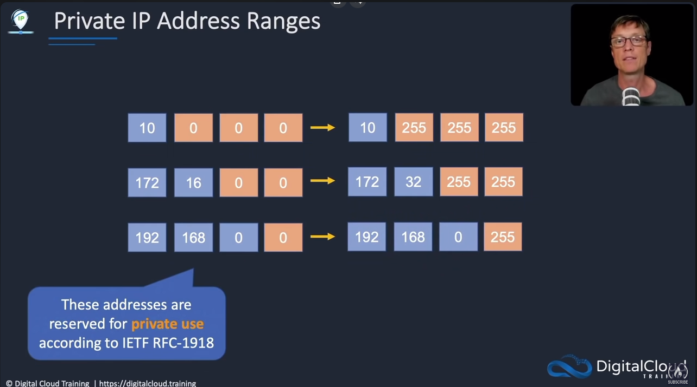
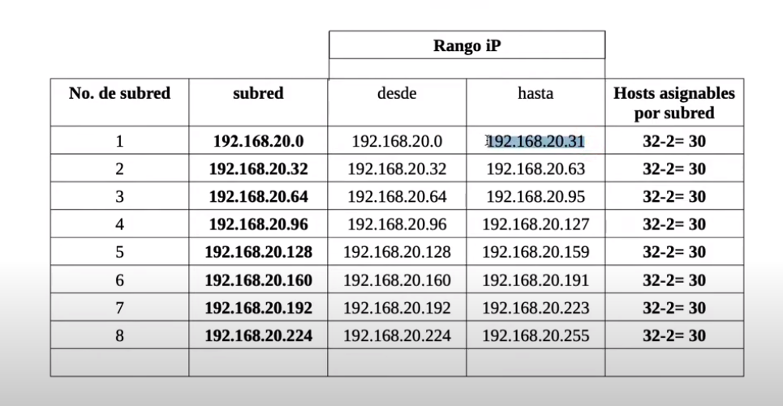
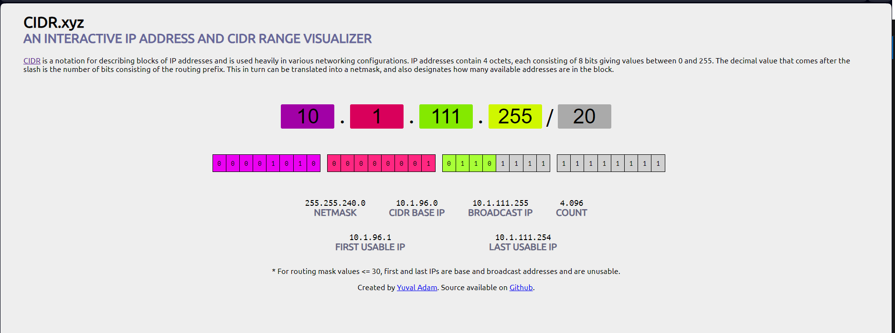
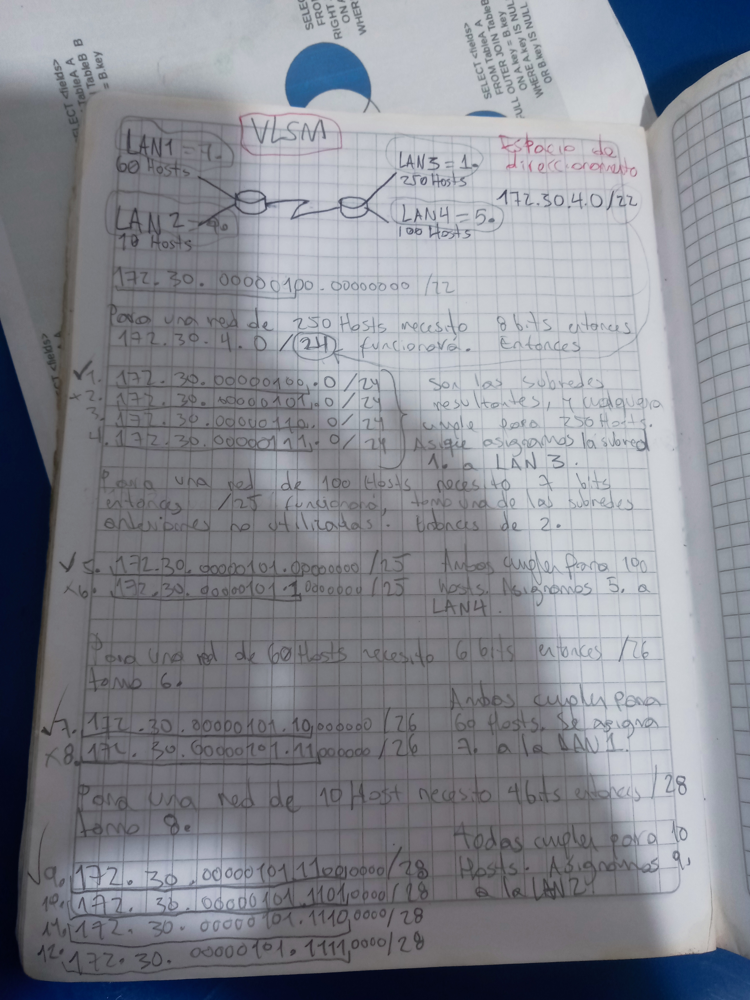

# ip

¿Qué es? es un número binario de 32 bits que utilizan los aparatos para comunicarse unos con otros. Se dividen en bytes (8 bits)
entonces la direccion IP está conformada por 4 bytes.

ejemplo

> 10000011011011000111101011001100

|||||
|-|-|-|-|
| 10000011 | 01101100 | 01111010 | 11001100 |
|||||

cada uno de esos bytes se transforma a decimal separado por puntos (notacion decimal punteada)

|||||
|-|-|-|-|
| 131 | 108 | 122 | 204 |
|||||

La dirección está compuesta por un identificador de red y un identificador de host, con cualquier cantidad de bits para cada uno.

¿de que depende? de la clase de red. La clasificación clásica es esta

Clase A (8 bits de red 24 bits de host)

|||||
|-|-|-|-|
| **red** | host | host | host |
|||||

Clase B (16 bits de red y 16 bits de host)

|||||
|-|-|-|-|
| **red** | **red** | host | host |
|||||

Clase C (24 bits de red y 8 bits de host)

|||||
|-|-|-|-|
| **red** | **red** | **red** | host |
|||||

Entonces si nos dan una dirección IP cualquiera, como sabemos a que clase pertenece????

|||||
|-|-|-|-|
| 192 | 168 | 100 | 50 |
|||||

Hay otro concepto que nos ayuda a identificar esto, y es el prefijo de red, que es la cantidad de bits que se usan para identificar la red, y su notación es un / al final de la dirección IP.

||||||
|-|-|-|-|-|
| 192 | 168 | 100 | 50 | **/24** |
||||||

en este ejemplo nuestra dirección tiene 24 bits de red y 8 bits de host, entonces es una clase C. Entocnes vamos a expresar esto en binario, los bytes de red en 1 y los de host en 0

|||||
|-|-|-|-|
| 11111111 | 11111111 | 11111111 | 00000000 |
|||||

Ahora esto en decimal es 
|||||
|-|-|-|-|
| 255 | 255 | 255 | 0 |
|||||

algo muy importante es que debido a las clasificaciones A, B y C, hay direcciones que no se pueden usar, por ejemplo las que empiezan con 0, 10, 127, 255, etc. Estas direcciones son reservadas para usos especiales. Y también se asignó el bit mas significativo de cada clase de la siguiente manera

es por eso que por ejemplo en las de clase A no hay 2^8 = 256 posibles redes sino 2^7 = 128, porque el bit mas significativo está reservado para identificar la clase de red.

# Subredes

Es una división de una red mas grande. Sirven para segmentar una red en redes mas pequeñas. Por ejemplo si tenemos una red de clase C con 254 hosts, y queremos dividirla en 2 redes de 127 hosts, entonces creamos 2 subredes de 7 bits de host cada una.

Las subredes hacen que las redes sean más eficientes. Mediante la creación de subredes, el tráfico de la red puede recorrer una distancia más corta sin tener que pasar por routers innecesarios para llegar a su destino.

Este proceso se realiza "prestando" bits de host, y aqui cobra importancia las máscaras. Por ejemplo

||||||
|:-:|:-:|:-:|:-:|:-:|
| 192 | 168 | 100 | 50 | **/24** |
| 11000000 | 10101000 | 01100100 | 00110010 | /24 |
| 11111111 | 11111111 | 11111111 | 00000000 | |
| 255 | 255 | 255 | 0 | |
||||||

En este ejemplo tenemos una dirección de clase C, con 24 bits de red y 8 bits de host. Ahora si queremos dividir esta red en 8 subredes, entonces tenemos que prestar 3 bit de host, y la máscara de subred sería /27

||||||
|:-:|:-:|:-:|:-:|:-:|
| 192 | 168 | 100 | 50 | /27 |
| 11000000 | 10101000 | 01100100 | 00110010 | /27 |
| 11111111 | 11111111 | 11111111 | <ins>111</ins>00000 | |
| 255 | 255 | 255 | **224** | |
||||||

Entonces nuestras **subredes** quedan así

||||||
|-|-|-|-|-|
| 192 | 168 | 100 | 0 | **/27** |
| 192 | 168 | 100 | 32 | **/27** |
| 192 | 168 | 100 | 64 | **/27** |
| 192 | 168 | 100 | 96 | **/27** |
| 192 | 168 | 100 | 128 | **/27** |
| 192 | 168 | 100 | 160 | **/27** |
| 192 | 168 | 100 | 192 | **/27** |
| 192 | 168 | 100 | 224 | **/27** |
||||||

ya que varía el ultimo octeto así

||||||
|-|-|-|-|-|
| 11000000 | 10101000 | 1100100 | <ins>000</ins>00000 ||
| 11000000 | 10101000 | 1100100 | <ins>001</ins>00000 ||
| 11000000 | 10101000 | 1100100 | <ins>010</ins>00000 ||
| 11000000 | 10101000 | 1100100 | <ins>011</ins>00000 ||
| 11000000 | 10101000 | 1100100 | <ins>100</ins>00000 ||
| 11000000 | 10101000 | 1100100 | <ins>101</ins>00000 ||
| 11000000 | 10101000 | 1100100 | <ins>110</ins>00000 ||
| 11000000 | 10101000 | 1100100 | <ins>111</ins>00000 ||
||||||

Entonces cada subred tiene 32 direcciones para host y 1 para la dirección de red y 1 para la dirección de broadcast. Entonces cada subred tiene 30 direcciones disponibles para host.

Veamos un ejemplo con la útlma subred

||||||
|-|-|-|-|-|
|1| 192 | 168 | 100 | 1110000<ins>1</ins> = 225 |
|2| 192 | 168 | 100 | 111000<ins>10</ins> = 226 |
|3| 192 | 168 | 100 | 111000<ins>11</ins> = 227 |
||||||

# CIDR

Classless Inter-Domain Routing o Enrutamiento entre dominios sin clases.

Es un método para asignar direcciones IP y enrutar el tráfico IP. Reemplazó al sistema de clases anterior que se basaba simplemente en la clase de la dirección IP.

Los enrutadores **incluyen en su operacion la mascara de subred** para determinar si una dirección IP pertenece a la misma red que la dirección IP de destino. Esto permite mas flexibilidad a la hora de asignar direcciones y se gasta menos bits para saber la clase de una dirección (lo cual se hacia viendo el primer octeto).

https://cidr.xyz

En este ejemplo podemos ver la forma en que la clase es ignorada, y simplemente nos fijamos en la mascara. El proceso funciona de forma similar, contando los bits de la mascara, y prestando bits de host para crear subredes.

# VLSM

Variable Length Subnet Masking o Máscara de subred de longitud variable. Aqui podremos poner en práctica todo lo aprendido con un ejemplo en que se le hacen **subredes a las subredes** ahorrándonos el desperdicio de direcciones.

