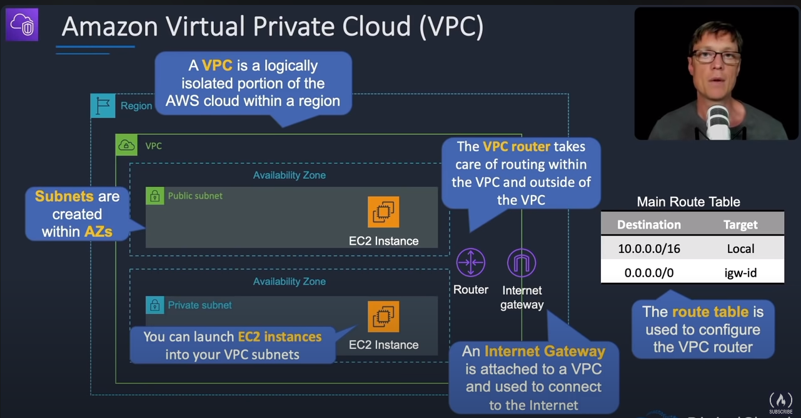
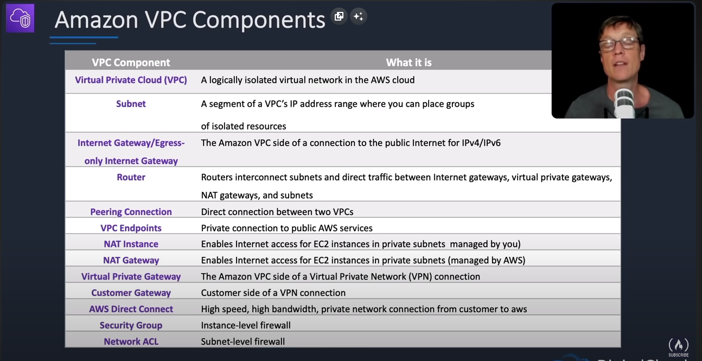
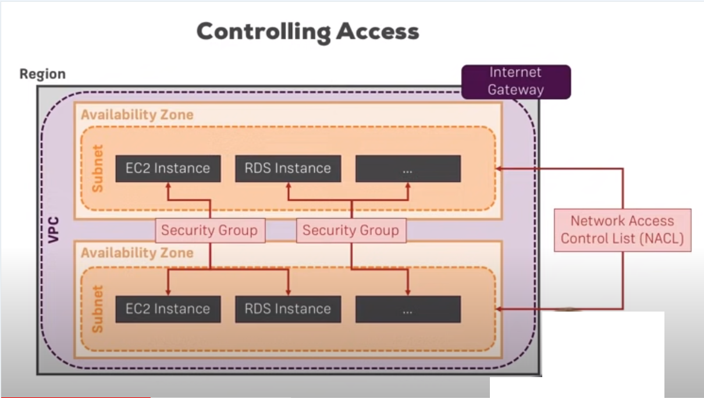
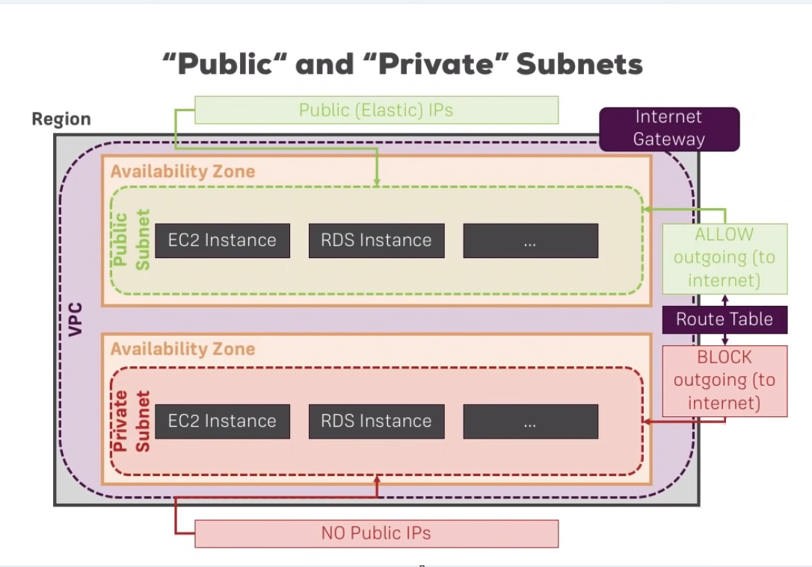

# Que es
**"Having your own network (or datacenter) in the cloud"**

Cuando creamos una cuenta de amazon esta viene con una VPC por defecto. Por ejemplo al entrar a EC2 podemos ver que en el formulario de creación de las instancias nos pide seleccionar una VPC, una subred, una IP etc.

VPC significa virtual private cloud, es una red propia en la nube. Es importante tener en cuenta que todos los recursos que lanzamos en amazon **viven** en **zonas de disponibilidad**. Las zona de disponibilidad son datacenters que pueden estar dispersos geográficamente en una región.

En la imagen se puede observar que la VPC es una red que abarca toda la region y permite de esta manera que los recursos puedan comunicarse entre si a pesar de que vivan en diferentes zonas de disponibilidad. De la misma manera estos recursos necesitan conectarse a internet. Es por eso que por defecto nuestra cuenta viene con una VPC creada.

Las suberedes de la imagen son subredes privadas **dentro** de la VPC, las cuales pueden ser cada zona des disponibilidad. Es como una subred en la subred. La VPC tiene un rango de direcciones que se divide entre las zonas de disponibilidad y luego cada una de ellas hereda un fragmento de ese rango direcciones de la VPC.

Podemos también concluir que las instancias reciben ambas direcciones IP, de la subred y de la VPC. 

Y finalmente toda la comunicación a internet se hace a través del Internet Gateway

Podemos controlar el acceso a nuestras redes y recursos a través de security groups, los cuales se crean dentro de la VPC, que funcionan básicamente como un firewall. ¿Qué trafico puede entrar a esta red? para eso creamos las NACLs (Network Access Control List) que son listas de control de acceso a la red.

En estos esquemas VPC incluso se puede controlar el routing de la red. Por ejemplo podemos decir si el tráfico puede entrar o salir de la VPC etc. También se puede controlar la asignación de ips publicas.

Debido a eso en muchos esquemas y diagramas de arquitecturas cloud están divididos en VPCs, por ejemplo una VPC para los servidores con base de datos y otra para los servidores de aplicaciones.

¿Qué pasaría entonces por ejemplo si necesitaramos actualizar el software de las máquinas dentro de la subred privada?, aws ofrece una solución mediante NAT Gateway (Network Address Translation) el cual traduce las ip internas en publicas.

Ahora creemos nuestro esquema 😉

# Security Group

Es un Firewall virtual. Su objetivo es bloquear todo el trafico excepto los puertos, protocolos y fuentes que se especifiquen.

Ejemplos de fuentes pueden ser un rango de IPs, otra red, otro security group etc.

Se pueden definir reglas para el trafico de entrada y salida.

 
