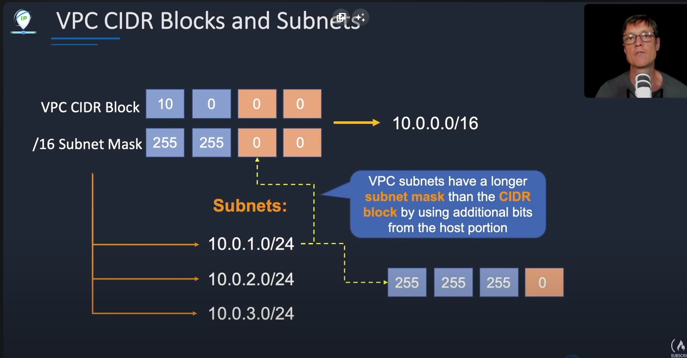
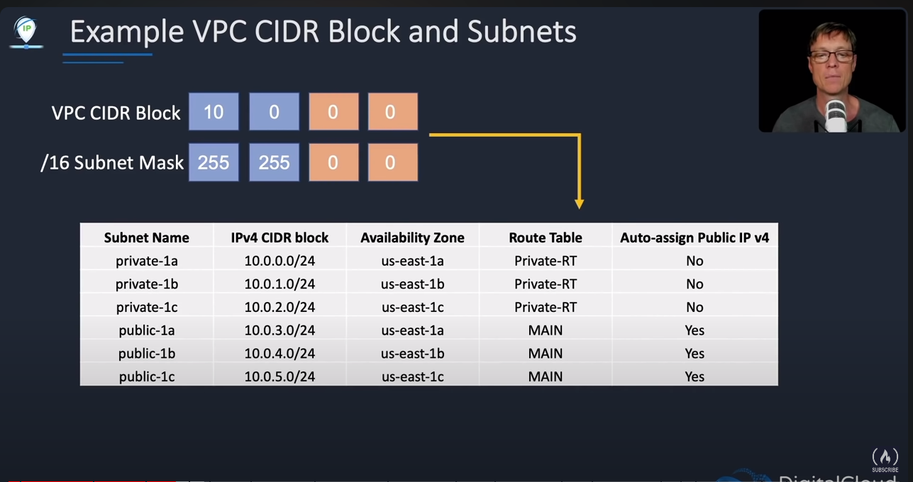
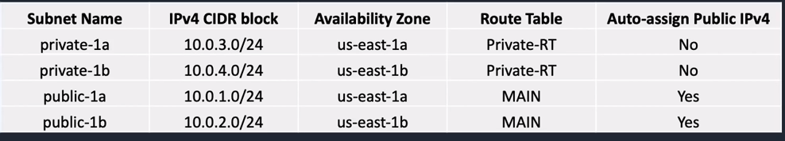
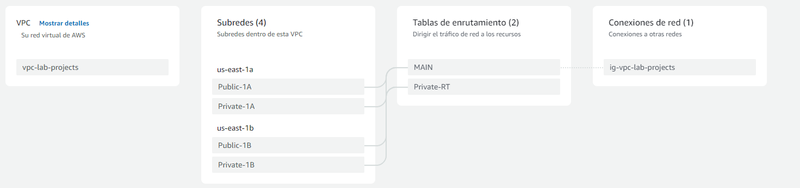

# CIDR guidelines

- El tamaño del bloque CIDR puede estar entre /16 y /28
- Un bloque CIDR no puede superponerse con otro bloque CIDR existente que esté asociado a la VPC
- No se puede increamentar o decrementar el tamaño de un bloque CIDR existente
- La priemra y última dirección no se pueden utilizar
- AWS recomienda utilizar la direcciones privadas (RFC 1918)
---
- 10.0.0.0 - 10.255.255.255 (10/8 prefix): La VPC puede ser /16 o mas pequeña, 10.0.0.0/16
- 172.16.0.0 - 172.31.255.255 (172.16/12 prefix): La VPC puede ser /16 o mas pequeña, 172.16.0.0/16
- 192.168.0.0 - 192.168.255.255 (192.168/16 prefix): La VPC puede ser mas pequeña, 192.168.0.0/20 
---



Este es un ejemplo de distribución en subredes para la dirección que nos entrega AWS.



En la imagen podemos ver que las redes públicas tienen en su Route Table MAIN, significa que dejamos la configuración por defecto, y para las privadas manejamos una configuración diferente para bloquear algo de tráfico


# Creating a custom VPC with Subnets



1. Ir a "Sus VPC" y click en crear VPC
2. Creemos solo la VPC por ahora, sin subredes
3. Asignamos un nombre 
4. El bloque CIDR puede ser cualquiera entre /16 y /28
5. El resto por defecto y click en crear
6. Una vez creada, click en acciones y editar la configuracion de VPC
7. Habilitar los nombres de host DNS y guardar
8. Vamos a subredes y click en crear subred
9. Seleccionamos nuestra VPC y empezamos a crear las subredes de nuestra esquema
10. Seleccionamos nuestras subredes públicas y click en Editar configuración
11. Habilitamos la autoasignación de dirección IPV4 pública

# Route table

1. Seleccionamos la opción de crear route tables
2. Seleccionamos un nombre y nuestra VPC
3. Una vez creada vamos a asociacion de subredes y editar
4. Seleccionamos nuestras subredes privadas y click en guardar
5. Una vez creada podremos observar que nuestras subredes privadas quedan asignadas explícitamente en nuestra tabla de enrutamiento
6. Si vamos a lista de tablas de enrutamiento veremos que se hay una tabla donde nuestras subredes publicas están asignadas, cambiemosle el nombre por MAIN 

# Internet Gateway

1. Vamos a Internet Gateways y click en crear Internet Gateway
2. Asignamos un nombre y click en crear
3. Una vez creada la seleccionamos y click en adjuntar a VPC
4. Seleccionamos nuestra VPC y click en conectar
5. Ahora volvemos a las tablas de enrutamiento, pestaña rutas, editar y agregamos una nueva
6. Elegimos la red de internet 0.0.0.0/0 y target nuestra Internet Gateway creada previamente.
7. Lo hicimos solo para MAIN porque no queremos que la privada se conecte a internet. Así queda nuestro esquema particular



# NAT Gateway
1. Creamos el nat gateway para que nuestra subred privada pueda conectarse a internet, el truco es que NAT gateway bloquea el tráfico que viene desde internet, pero permite que el tráfico salga hacia internet. Esto es [autoadministrado](https://www.youtube.com/watch?v=ujXr0i5EoHE) por AWS así que no debemos preocuparnos, solo hay que crearlo. 
2. Click en crear NAT Gateway, y asignamos un nombre
3. Algo importante es seleccionar una **subred pública** para que pueda existir tráfico desde internet
4. Conectividad pública
5. Click en asignar IP elástica y crear
6. Volvemos a las tablas de enrutamiento, seleccionamos la tabla de enrutamiento privada
7. Vamos a rutas y editar, agregamos una nueva ruta
8. Asignamos la ruta de internet 0.0.0.0/0 al target Nat gateway, y ahí seleccionamos el que creamos previamente
9. **Esto tiene costo** así que cuidado ⚠️

# Security Groups
1. Actuan como un firewall virtual. Seleccionamos la opción de crear security group
2. Asignamos un nombre y una descripción, y seleccionamos nuestra VPC
3. Por ahora para ambas las reglas de entrada y salida, permitiremos todo el tráfico
4. Click en crear


Para probar todo lo que hemos hecho podemos crear algunas instancias EC2 y hacer ping entre ellas y a alguna web de internet. Mediante el CLI de amazon podemos crearlas

```bash
aws ec2 run-instances --image-id <value> --instance-type <value> --security-group-ids <value> --subnet-id <value> --key-name <value> --user-data <value>
```

Podemos ver que podemos asignar nuestro grupo de seguridad y la subred a la cual pernetecerá nuestra instancia.