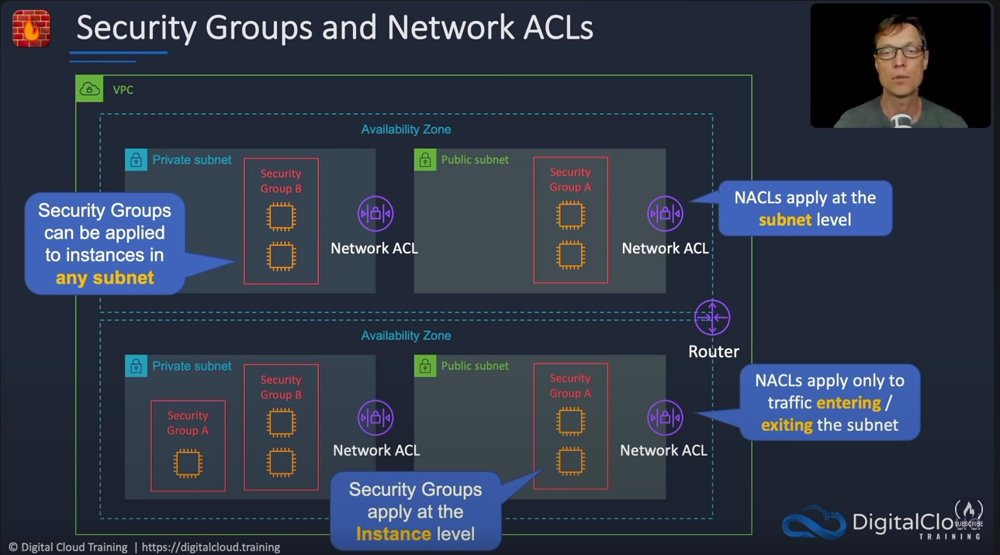
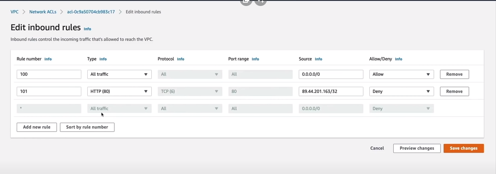
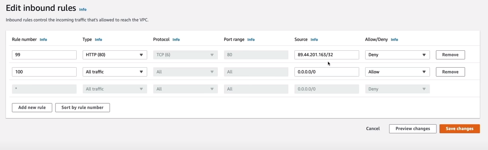

# Security Groups and Network ACLs

Aunque ambas tienen un objetivo similar, encontramos diferencia en el nivel de operación. Los security groups son a nivel de instancia, y los Network ACLs son a nivel de subred.

Por ejemplo, un grupo de seguridad se puede configurar para permitir solamente el tráfico desde otro grupo de seguridad.

Se pueden clasificar como stateful y stateless firewalls. Stateful permiten el trafico de retorno automáticamente y es lo que son los grupos de seguridad. Los stateless verifican el trafico en ambos sentidos y eass son las ACL.

Los grupos de seguridad solo permiten reglas **allow**, es decir, si no se especifica que es permitido cierto tráfico, entonces por defecto estará denegado. en cambio las ACL permiten reglas **allow** y **deny**.

1. Vamos a security groups y click en crear security group
2. Creemos el private-web-vpc-lab-projects-sg
3. Como aprendimos antes, un grupo de seguridad puede tener como regla recibir el tráfico de otro grupo de seguridad. Entonces eso es lo que vamos a hacer, en Inbound rules asginamos que el tráfico HTTP venga exclusivamente de nuestro otro grupo de seguridad. Le damos click en crear.
4. Ahora podemos ir a nuestra instancia de EC2 y asignarlo tranquilamente.

Algo importante es que si queiremos conectarnos a nuestras instancias de EC2 mediante SSH, debemos crear una regla de entrada para el puerto 22. De lo contrario nuestro security group bloqueará el trafico y no podremos conectarnos.

# Network ACLs
Las ACL funcionan de una manera similar. Aunque hay que tener en cuenta algo importante. Cuando definimos las reglas de la ACL, estas se ejecutan en orden, por ejemplo:

Si primero defino una regla que permita todo el tráfico, y luego una regla que bloqueé por ejemplo la IP actual de mi PC, podré acceder ya que primero permití todo el tráfico.

Para solucionar ese error tenemos que situar primero nuestra regla de denegación y luego la otra, es decir

# VPC Peering

Sirve para conectar VPC diferentes entre si y permitir la comunicación

[Continuar el tutorial aqui](https://www.youtube.com/watch?v=g2JOHLHh4rI&t=66m31s)